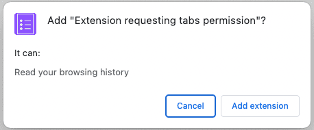
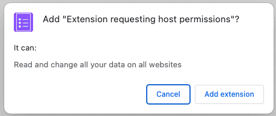

# Chrome Extensions

This folder is a collection of Google Chrome extensions that I've worked on.

Resources:

[Chrome for Developers](https://developer.chrome.com/docs/extensions)

## Update: Chrome Manifest V3

Summary: Google Chrome will shut down Manifest V2 and all its extensions (mainly to hinder adblocker and content-filtering extensions). Instead it will opt to use the limited Manifest V3 exclusively.

- [Google Chrome’s plan to limit ad blocking extensions kicks off next week (beginning of June 2024)](https://arstechnica.com/gadgets/2024/05/google-starts-deprecating-older-more-capable-chrome-extensions-next-week/)

"Google Chrome will be shutting down its older, more capable extension system, Manifest V2, in favor of exclusively using the more limited Manifest V3. The deeply controversial Manifest V3 system was announced in 2019, and the full switch has been delayed a million times, but now Google says it's really going to make the transition: As [previously announced](https://arstechnica.com/gadgets/2023/11/google-chrome-will-limit-ad-blockers-starting-june-2024/), the phase-out of older Chrome extensions is starting next week."

### Google Chrome's extension system transition from Manifest V2 to Manifest V3:

- **Background:**
  - Google Chrome has been working on a new extension system called "Manifest V3."
  - The goal of Manifest V3 is to improve security, privacy, performance, and trustworthiness within the extension ecosystem.
  - However, this transition has been controversial and delayed since its announcement in 2019.

- **What's Happening:**
  - Google is officially phasing out the older, more capable extension system (Manifest V2) in favor of Manifest V3.
  - The full switch is starting next week, as previously announced.
  - Manifest V3 offers benefits like Offscreen Documents, a new User Scripts API, and enhanced content filtering support.

- **Controversy:**
  - Some groups, including the Electronic Frontier Foundation (EFF), have criticized Manifest V3.
  - The EFF called it "deceitful and threatening," expressing concerns about its impact on web extensions.
  - They believe Manifest V3 will restrict the capabilities of extensions, especially those designed for monitoring, modification, and computation alongside browser interactions with websites.

Despite the controversy, Google remains committed to the transition. Users relying on Manifest V2 extensions will see warnings, and developers are encouraged to switch to Manifest V3 alternatives. It's an ongoing development, and the transition is expected to be completed by early next year.

- **Content Filtering Limitations:**
  - A major point of concern is the limitations on "content filtering" APIs used by ad blockers and anti-tracking extensions.
  - These APIs allow extensions to fight against ad companies like Google by blocking unwanted content.
  - Google, which heavily relies on advertising revenue, has not provided a clear explanation for why Manifest V3 restricts content filtering.
  - It's unclear how these limitations align with the stated goals of improving security, privacy, performance, and trustworthiness.

- **Malicious Extensions vs. Content Filtering:**
  - Philipp Kewisch from the Firefox team pointed out that malicious extensions primarily aim to spy on users and collect data.
  - Content filtering, on the other hand, is not directly related to this goal.
  - Despite this, Manifest V3 imposes restrictions on content filtering capabilities.

- **Context:**
  - Interestingly, Google is simultaneously building an ad system directly into Chrome, and platforms like YouTube are actively combating ad blockers.

The limitations around content filtering in Manifest V3 have raised concerns, especially given Google's advertising-centric business model. This will have a large impact on ad blockers and privacy-focused extensions.

"A big source of skepticism around Manifest V3 is limitations around "content filtering," aka the APIs ad blockers and anti-tracking extensions use to fight ad companies like Google. Google, which makes about 77 percent of its revenue from advertising, has not published a serious explanation as to why Manifest V3 limits content filtering, and it's not clear how that aligns with the goals of "improving the security, privacy, performance and trustworthiness." Like Kewisch said, the primary goal of malicious extensions is to spy on users and slurp up data, which has nothing to do with content filtering. This is all happening while Google is building an ad system directly into Chrome, and Google properties like YouTube are making aggressive moves against ad blockers."

## What is a Google Chrome Extension?

A **Google Chrome extension** is a small program that can be installed into the Chrome web browser. These extensions serve to **modify the browser's functionality** by either adding new features or altering existing behaviors.

**Functionality Enhancement**: Chrome extensions enhance the browsing experience by adding extra features or streamlining tasks. Examples of functionalities they can add include:
    - **Blocking ads**: Preventing advertisements from being displayed.
    - **Memory optimization**: Improving Chrome's efficiency.
    - **To-do lists or notes**: Adding productivity tools.
    - **Password management**: Enhancing security.
    - **Text copying**: Making it easier to copy text from websites.
    - **Privacy protection**: Safeguarding your browsing experience.

**Chrome extensions extend your browser's functionality, making your browsing experience more convenient and efficient.**

## Hello World extension

[Build your first extension](https://developer.chrome.com/docs/extensions/get-started/tutorial/hello-world)

Let's begin by **developing a straightforward extension** that triggers a popup when clicked in the top-right corner of the Google Chrome toolbar.

1. Project structure

Here is the project structure: 

```sh
- hello
  |- manifest.json
  |- icon.png
  |- hello.html
```

To store the files for the extension, create a folder named `hello`.

2. Create `manifest.json`

```json
{
  "manifest_version": 3,
  "name": "Hello World",
  "description": "Base Level Extension",
  "version": "1.0",
  "action": {
    "default_popup": "hello.html",
    "default_icon": "icon.png"
  }
}
```

3. Create `hello.html`

```html
<html>
  <body>
    <h1>Hello World</h1>
  </body>
</html>
```

4. Add `icon.png`

You can create your own icon or download one from [here](https://storage.googleapis.com/web-dev-uploads/image/WlD8wC6g8khYWPJUsQceQkhXSlv1/gmKIT88Ha1z8VBMJFOOH.png).

5. Load the extension
   
The extension now displays a popup when the extension's action icon (toolbar icon) is clicked. You can test it in Chrome by loading it locally. Ensure all files are saved.

### What is manifest.json?

- `manfest.json`

This JSON file describes the extension's capabilities and configuration. For example, most manifest files contain an `"action"` key which declares the image Chrome should use as the extension's action icon and the HTML page to show in a popup when the extension's action icon is clicked.

## Test an extension locally on your Google Chrome browser

[Load an unpacked extension docs](https://developer.chrome.com/docs/extensions/get-started/tutorial/hello-world#load-unpacked)

To load an unpacked extension in developer mode:

  1. Go to the Extensions page by entering `chrome://extensions` in a new tab. (By design `chrome://` URLs are not linkable.)
    - Alternatively, click the Extensions menu puzzle button and select **Manage Extensions** at the bottom of the menu.
    - Or, click the Chrome menu, hover over **More Tools**, then select **Extensions**.
  2. Enable Developer Mode by clicking the toggle switch next to **Developer mode**.
  3. Click the **Load unpacked** button and select the extension directory.

The extension has been successfully installed. If no extension icons were included in the manifest, a generic icon will be created for the extension.

## Run scripts on every page

- [Run scripts on every tab](https://developer.chrome.com/docs/extensions/get-started/tutorial/scripts-on-every-tab)

Let's create an extension that runs a script on every page.

**Concepts:**
  - The extension manifest.
  - What icon sizes an extension uses.
  - How to inject code into pages using [content scripts](https://developer.chrome.com/docs/extensions/develop/concepts/content-scripts).
  - How to use match patterns.
  - Extension permissions.

### Build the extension

Create a folder named `reading-time` to hold the extension's files.

#### 1. Add information about the extension

The manifest JSON file is the only required file. It holds important information about the extension. Create a `manifest.json` file in the *root* of the project and add the following code:

```json
{
  "manifest_version": 3,
  "name": "Reading time",
  "version": "1.0",
  "description": "Add the reading time to Chrome Extension documentation articles"
}
```

These keys contain basic metadata for the extension. They control how the extension appears on the extensions page and, when published, on the Chrome Web Store. To dive deeper, check out the `"name"`, `"version"` and `"description"` keys on the [Manifest](https://developer.chrome.com/docs/extensions/reference/manifest) overview page.

**Other facts about the extension manifest**

- It must be located at the **root** of the project.
- The only required keys are "`manifest_version`", "`name`", and "`version`".
- It supports comments (`//`) during development, but these must be removed before uploading your code to the Chrome Web Store.

#### 2. Provide the icons

So, why do you need icons? Although [icons](https://developer.chrome.com/docs/extensions/reference/manifest/icons) are optional during development, they are required if you plan to distribute your extension on the Chrome Web Store. They also appear in other places like the Extensions Management page.

Create an `images` folder and place the icons inside. You can download the icons on [GitHub](https://github.com/GoogleChrome/chrome-extensions-samples/tree/main/functional-samples/tutorial.reading-time/images). Next, add the highlighted code to your manifest to declare icons:

```json
{
  "manifest_version": 3,
  "name": "Reading time",
  "version": "1.0",
  "description": "Add the reading time to Chrome Extension documentation articles",

  "icons": {
    "16": "images/icon-16.png",
    "32": "images/icon-32.png",
    "48": "images/icon-48.png",
    "128": "images/icon-128.png"
  }
}
```

We recommend using PNG files, but other file formats are allowed, **except for SVG files**.

**Where are these differently-sized icons displayed?**

|Icon size|Icon use|
|---------|--------|
|16x16|	Favicon on the extension's pages and context menu.|
|32x32| Windows computers often require this size. |
|48x48| Displays on the Extensions page. |
|128x128|	Displays on installation and in the Chrome Web Store. |

#### 3. Declare the content script

Extensions can run scripts that read and modify the content of a page. These are called ***content scripts***. They live in an [isolated world](https://developer.chrome.com/docs/extensions/develop/concepts/content-scripts#isolated_world), meaning they can make changes to their JavaScript environment without conflicting with their host page or other extensions' content scripts.

Add the following code to the `manifest.json` to register a content script called `content.js`.

```json
{
  "content_scripts": [
    {
      "js": ["scripts/content.js"],
      "matches": [
        "https://developer.chrome.com/docs/extensions/*",
        "https://developer.chrome.com/docs/webstore/*"
      ]
    }
  ]
}
```

The `"matches"` field can have one or more [match patterns](https://developer.chrome.com/docs/extensions/develop/concepts/match-patterns). These allow the browser to identify which sites to inject the content scripts into. Match patterns consist of three parts: `<scheme>://<host><path>`. They can contain `'*'` characters.

**Does this extension display a permission warning?**

When a user installs an extension, the browser informs them what the extension can do. Content scripts request permission to run on sites that meet the match pattern criteria.

In this example, the user would see the following permission warning:

```sh
Add "Reading Time"?

It can:
Read and change yoru data on developer.chrome.com
```

To dive deeper on extension permissions, see [Declaring permissions and warn users](https://developer.chrome.com/docs/extensions/develop/concepts/permission-warnings).

#### 4. Calculate and insert the reading time

Content scripts can use the standard [Document Object Model (DOM)](https://developer.mozilla.org/docs/Web/API/Document_Object_Model) to read and change the content of a page. The extension will first check if the page contains the `<article>` element. Then, it will count all the words within this element and create a paragraph that displays the total reading time.

Create a file called `content.js` inside a folder called `scripts` and add the following code:

```javascript
const article = document.querySelector("article");

// `document.querySelector` may return null if the selector doesn't match anything.
if (article) {
  const text = article.textContent;
  const wordMatchRegExp = /[^\s]+/g; // Regular expression
  const words = text.matchAll(wordMatchRegExp);
  // matchAll returns an iterator, convert to array to get word count
  const wordCount = [...words].length;
  const readingTime = Math.round(wordCount / 200);
  const badge = document.createElement("p");
  // Use the same styling as the publish information in an article's header
  badge.classList.add("color-secondary-text", "type--caption");
  badge.textContent = `⏱️ ${readingTime} min read`;

  // Support for API reference docs
  const heading = article.querySelector("h1");
  // Support for article docs with date
  const date = article.querySelector("time")?.parentNode;

  (date ?? heading).insertAdjacentElement("afterend", badge);
}
```

**Interesting JavaScript used in this code**

- [Regular expressions](https://developer.mozilla.org/docs/Web/JavaScript/Guide/Regular_Expressions#writing_a_regular_expression_pattern) used to count only the words inside the `<article>` element.
- [insertAdjacentElement()](https://developer.mozilla.org/docs/Web/API/Element/insertAdjacentElement) used to insert the reading time node after the element.
- The [classList](https://developer.mozilla.org/docs/Web/API/Element/classList) property used to add CSS class names to the element class attribute.
- [Optional chaining](https://developer.mozilla.org/docs/Web/JavaScript/Reference/Operators/Optional_chaining) used to access an object property that may be undefined or null.
- [Nullish coalescing](https://developer.mozilla.org/docs/Web/JavaScript/Reference/Operators/Nullish_coalescing_operator) returns the `<heading>` if the `<date>` is null or undefined.

feat: Add script for reading time calculation

This commit introduces a content script that calculates the reading time for articles displayed on specific URLs. The script is designed to be injected into web pages that match the patterns defined in manifest.json.

The content script performs the following actions:

1. Locates the article element on the page.
2. Retrieves the text content from the article.
3. Counts the number of words using a regular expression.
4. Calculates the reading time based on an assumed average reading speed.
5. Creates a badge displaying the estimated reading time (e.g., "⏱️ 5 min read").
6. Inserts the badge after the article's date or heading (if available).

### Test that it works

**Verify that the file structure of your project** looks like the following:

```sh
|- reading-time
  |- manifest.json
  |- scripts
    |- content.js
  |- images
    |- icon-16.png
    |- icon-32.png
    |- icon-48.png
    |- icon-128.png
```

**Load your extension locally**

To load an unpacked extension in developer mode, follow the steps in [Development Basics](https://developer.chrome.com/docs/extensions/get-started/tutorial/hello-world#load-unpacked).

**Open an extension or Chrome Web Store documentation**

Here are a few pages you can open to see how long each article will take to read.

  - [Publish in the Chrome Web Store](https://developer.chrome.com/docs/webstore/publish)
  - [Understanding Content Scripts](https://developer.chrome.com/docs/extensions/develop/concepts/content-scripts)

It should look like this:

```sh
Welcome
Learn about developing extensions for Chrome.
Published oon MOnday, November 9, 202
⏱️1 min read
```
### Potential enhancements

Based on what you've learned today, try to implement any of the following:

- Add another **match pattern** in the manifest.json to support other [chrome developer](https://developer.chrome.com/docs/) pages, like for example, the [Chrome DevTools](https://developer.chrome.com/docs/devtools/) or [Workbox](https://developer.chrome.com/docs/workbox).
- Add a new content script that calculates the reading time to any of your favorite blogs or documentation sites.

Hint: You can use DevTools to [inspect DOM elements](https://developer.chrome.com/docs/devtools/dom).

## Inject scripts into the active tab

Simplify the styling of the current page by clicking the extension toolbar icon.

### Overview

This tutorial builds an extension that simplifies the styling of the Chrome extension and Chrome Web Store documentation pages so that they are easier to read.

In this guide, we're going to explain how to do the following:

- Use the extension service worker as the event coordinator.
- Preserve user privacy through the `"activeTab"` permission.
- Run code when the user clicks the extension toolbar icon.
- Insert and remove a style sheet using the [Scripting](https://developer.chrome.com/docs/extensions/reference/api/scripting) API.
- Use a keyboard shortcut to execute code.

### Build the extension

To start, create a new directory called `focus-mode` that will hold the extension's files. If you prefer, you can download the complete source code from [GitHub](https://github.com/GoogleChrome/chrome-extensions-samples/tree/main/functional-samples/tutorial.focus-mode).

#### 1. Add the extension data and icons

Create a file called `manifest.json` and include the following code.

```json
{
  "manifest_version": 3,
  "name": "Focus Mode",
  "description": "Enable focus mode on Chrome's official Extensions and Chrome Web Store documentation.",
  "version": "1.0",
  "icons": {
    "16": "images/icon-16.png",
    "32": "images/icon-32.png",
    "48": "images/icon-48.png",
    "128": "images/icon-128.png"
  }
}
```

Create an `images` folder then [download the icons](https://github.com/GoogleChrome/chrome-extensions-samples/tree/main/functional-samples/tutorial.focus-mode/images) into it.

feat: Initialize manifest for focus-mode extension

This commit sets up the initial manifest for the "Focus Mode" extension. The manifest will define the extension's behavior, permissions, and other essential details.

feat: Add icons for focus-mode chrome extension

#### 2. Initialize the extension

Extensions can monitor browser events in the background using the [extension's service worker](https://developer.chrome.com/docs/extensions/develop/concepts/service-workers). Service workers are special JavaScript environments that handle events and terminate when they're not needed.

Start by registering the service worker in the `manifest.json` file:

```json
{
  ...
  "background": {
    "service_worker": "background.js"
  },
  ...
}
```

Create a file called `background.js` and add the following code:

```javascript
chrome.runtime.onInstalled.addListener(() => {
  chrome.action.setBadgeText({
    text: "OFF",
  });
});
```

The first event our service worker will listen for is `runtime.onInstalled()`. This method allows the extension to set an initial state or complete some tasks on installation. Extensions can use the [Storage API](https://developer.chrome.com/docs/extensions/reference/api/storage) and [IndexedDB](https://developer.mozilla.org/docs/Web/API/IndexedDB_API) to store the application state. In this case, though, since we're only handling two states, we will use the action's badge text itself to track whether the extension is 'ON' or 'OFF'.

Key term: The [action's badge](https://developer.chrome.com/docs/extensions/reference/api/action#badge) is a colored banner on top of the extension action (toolbar icon).

#### 3. Enable the extension action

The ***extension action*** controls the extension's toolbar icon. So whenever the user clicks the extension icon, it will either run some code (like in this example) or display a popup. Add the following code to declare the extension action in the `manifest.json` file:

```json
{
  ...
  "action": {
    "default_icon": {
      "16": "images/icon-16.png",
      "32": "images/icon-32.png",
      "48": "images/icon-48.png",
      "128": "images/icon-128.png"
    }
  },
  ...
}
```

feat: Add extension action configuration

This commit adds an "action" section to the manifest file, specifying the default icon for the extension. The icon sizes are provided for different contexts (16x16, 32x32, 48x48, and 128x128).

**Use the activeTab permission to protect user privacy**

The `activeTab` permission grants the extension *temporary* ability to execute code on the active tab. It also allows access to [sensitive properties](https://developer.chrome.com/docs/extensions/develop/concepts/activeTab#what-activeTab-allows) of the current tab.

This permission is enabled when the user ***invokes*** the extension. In this case, the user invokes the extension by clicking on the extension action.

**What other user interactions enable the activeTab permission in my own extension?**
   - Pressing a keyboard shortcut combination.
   - Selecting a context menu item.
   - Accepting a suggestion from the omnibox.
   - Opening an extension popup.

The `"activeTab"` permission allows users to *purposefully* choose to run the extension on the focused tab; this way, it protects the user's privacy. Another benefit is that it does not trigger a [permission warning](https://developer.chrome.com/docs/extensions/develop/concepts/permission-warnings#permissions_with_warnings).

To use the `"activeTab"` permission, add it to the manifest's permission array:

```json
{
  ...
  "permissions": ["activeTab"],
  ...
}
```

feat: Add activeTab permission for user privacy

- This commit enhances user privacy by granting the extension the 'activeTab' permission. 
- This permission allows the extension to interact with the currently active tab without exposing sensitive data.
- This permission is enabled when the user invokes the extension. In this case, the user invokes the extension by clicking on the extension action.

#### 4. Track the state of the current tab

After the user clicks the extension action, the extension will check if the URL matches a documentation page. Next, it will check the state of the current tab and set the next state. Add the following code to `background.js`:

```js
const extensions = 'https://developer.chrome.com/docs/extensions';
const webstore = 'https://developer.chrome.com/docs/webstore';

chrome.action.onClicked.addListener(async (tab) => {
  if (tab.url.startsWith(extensions) || tab.url.startsWith(webstore)) {
    // Retrieve the action badge to check if the extension is 'ON' or 'OFF'
    const prevState = await chrome.action.getBadgeText({ tabId: tab.id });
    // Next state will always be the opposite
    const nextState = prevState === 'ON' ? 'OFF' : 'ON';

    // Set the action badge to the next state
    await chrome.action.setBadgeText({
      tabId: tab.id,
      text: nextState,
    });
  }
});
```

feat: Toggle extension state on icon click

This commit adds functionality to toggle the extension state when the user clicks the extension icon. If the active tab URL starts with either the extensions or webstore documentation URLs, the badge text switches between 'ON' and 'OFF'.

Here's what each part of the code does:

1. **URL Definitions**:
   - The `extensions` and `webstore` variables store URLs related to Chrome extensions and the Chrome Web Store documentation, respectively.

2. **Event Listener**:
   - `chrome.action.onClicked.addListener(async (tab) => { ... });`
     - This line adds an event listener to the `onClicked` event of the extension icon (browser action).
     - When the user clicks the extension icon, the arrow function (`async (tab) => { ... }`) is executed.
     - The `tab` parameter represents the currently active tab.

3. **URL Check**:
   - `if (tab.url.startsWith(extensions) || tab.url.startsWith(webstore)) { ... }`
     - This condition checks if the URL of the active tab starts with either the `extensions` or `webstore` URL.
     - If true, the following actions are performed.

4. **Badge State Toggle**:
   - `const prevState = await chrome.action.getBadgeText({ tabId: tab.id });`
     - Retrieves the current badge text (which represents the extension state) for the active tab.
   - `const nextState = prevState === 'ON' ? 'OFF' : 'ON';`
     - Determines the next state (either 'ON' or 'OFF') based on the current state.
   - `await chrome.action.setBadgeText({ tabId: tab.id, text: nextState });`
     - Sets the badge text for the extension icon to the calculated next state.

In short, the service worker toggles the extension state (badge text) between 'ON' and 'OFF' when the user clicks the extension icon, but only for specific URLs related to extensions and the Chrome Web Store.

#### 5. Add or remove the style sheet

Now it's time to change the layout of the page. Create a file named `focus-mode.css` and include the following code:

```css
body > .scaffold > :is(top-nav, navigation-rail, side-nav, footer),
main > :not(:last-child),
main > :last-child > navigation-tree,
main .toc-container {
  display: none;
}

main > :last-child {
  margin-top: min(10vmax, 10rem);
  margin-bottom: min(10vmax, 10rem);
}
```

Insert or remove the style sheet using the [Scripting](https://developer.chrome.com/docs/extensions/reference/api/scripting) API. Start by declaring the `"scripting"` permission in the manifest:

```json
{
  ...
  "permissions": ["activeTab", "scripting"],
  ...
}
```

feat: Add scripting permission to manifest

This commit grants the extension the 'scripting' permission, allowing it to interact with web pages using the Chrome Scripting API. This permission is essential for enabling advanced features.

**Success**: The Scripting API does not trigger a [permission warning](https://developer.chrome.com/docs/extensions/develop/concepts/permission-warnings#permissions_with_warnings).

Finally, in `background.js` add the following code to change the layout of the page:

```javascript
  // ...
    if (nextState === "ON") {
      // Insert the CSS file when the user turns the extension on
      await chrome.scripting.insertCSS({
        files: ["focus-mode.css"],
        target: { tabId: tab.id },
      });
    } else if (nextState === "OFF") {
      // Remove the CSS file when the user turns the extension off
      await chrome.scripting.removeCSS({
        files: ["focus-mode.css"],
        target: { tabId: tab.id },
      });
    }
  }
});
```

feat: Toggle CSS file based on extension state

This commit adds functionality to insert or remove a CSS file when the user toggles the extension state ('ON' or 'OFF'). The CSS file is applied to the active tab.

**Can I use the Scripting API to inject code instead of a style sheet?**

**Yes**. You can use `scripting.executeScript()` to inject JavaScript.

#### 6. *Optional*: Assign a keyboard shortcut

We can add a shortcut to make it easier to enable or disable focus mode. Add the `"commands"` key to the manifest.

```json
{
  ...
  "commands": {
    "_execute_action": {
      "suggested_key": {
        "default": "Ctrl+B",
        "mac": "Command+B"
      }
    }
  }
}
```

The `"_execute_action"` key runs the same code as the `action.onClicked()` event, so no additional code is needed.

feat: Add commands in focus-mode manifest

- Define keyboard shortcuts (Ctrl+B for Windows, Command+B for Mac) to toggle focus mode.


### Test that it works

**Verify that the file structure of your project** looks like the following:

```sh
|- focus-mode
  |- manifest.json
  |- background.js
  |- focus-mode.css
  |- images
    |- icon-16.png
    |- icon-32.png
    |- icon-48.png
    |- icon-128.png
```

**Load your extension locally**

To load an unpacked extension in developer mode, follow the steps in [Development Basics](https://developer.chrome.com/docs/extensions/get-started/tutorial/hello-world#load-unpacked).

**Test the extension on a documentation page**

First, open any of the following pages:

- [Welcome to the Chrome Extension documentation](https://developer.chrome.com/docs/extensions)
- [Publish in the Chrome Web Store](https://developer.chrome.com/docs/webstore/publish)
- [Scripting API](https://developer.chrome.com/docs/extensions/reference/api/scripting)

Then, click the extension action. If you set up a [keyboard shortcut](https://developer.chrome.com/docs/extensions/get-started/tutorial/scripts-activetab#step-6), you can test it by pressing `Ctrl + B` or `Cmd + B`.

What the script should do on the active tab is enable the CSS file. The CSS file in turn hides specific elements such as the top navbar and sidebars, while adjusting the margins for the content within `main`. This provides and austere and minimalistic look to improve the layout and visual presentation of the page when focus mode extension is enabled.

## Handle events with service workers

The `quick-api-reference` extension allows users to quickly navigate to Chrome API reference pages using the omnibox. This extension demonstrates how to handle events with service workers.

The events from the following APIs have been handled: `chrome.runtime`, `chrome.omnibox` and `chrome.alarms`.

### Overview

This tutorial provides an introduction to Chrome Extension service workers. As part of this tutorial, you will build an extension that allows users to quickly navigate to Chrome API reference pages using the omnibox. You will learn how to:

- Register your service worker and import modules.
- Debug your extension service worker.
- Manage state and handle events.
- Trigger periodic events.
- Communicate with content scripts.

### Build the extension

Start by creating a new directory called `quick-api-reference` to hold the extension files, or download the source code from [GitHub](https://github.com/GoogleChrome/chrome-extensions-samples/tree/main/functional-samples/tutorial.quick-api-reference).

Here's the outline for the initial steps to build the extension.

- Set up project structure and directory layout
- Create manifest.json with necessary metadata
- Prepare icon images
- Define service-worker.js for background tasks

#### 1. Register the service worker

Create the [manifest](https://developer.chrome.com/docs/extensions/reference/manifest) file in the root of the project and add the following code:

`manifest.json`
```json
{
  "manifest_version": 3,
  "name": "Open extension API reference",
  "version": "1.0.0",
  "icons": {
    "16": "images/icon-16.png",
    "128": "images/icon-128.png"
  },
  "background": {
    "service_worker": "service-worker.js"
  }
}
```

Extensions register their service worker in the manifest, which only takes a single JavaScript file. There's no need to call `navigator.serviceWorker.register()`, like you would in a web page.

Create an `images` folder then [download the icons](https://github.com/GoogleChrome/chrome-extensions-samples/tree/main/functional-samples/tutorial.quick-api-reference/images) into it.

#### 2. Import multiple service worker modules

Our service worker implements two features. For better maintainability, we will implement each feature in a separate module. First, we need to declare the service worker as an [ES Module](https://web.dev/es-modules-in-sw/) in our manifest, which allows us to import modules in our service worker:

```json
{
 "background": {
    "service_worker": "service-worker.js",
    "type": "module"
  },
}
```
Create the `service-worker.js` file and import two modules:

```javascript
import './sw-omnibox.js';
import './sw-tips.js';
```

Create these files and add a console log to each one.

`sw-omnibox.js`

```javascript
console.log("sw-omnibox.js");
```

`sw-tips.js`

```javascript
console.log("sw-tips.js")
```

See [Importing scripts](https://developer.chrome.com/docs/extensions/develop/concepts/service-workers/basics#import-scripts) to learn about other ways to import multiple files in a service worker.

Tip: Remember to set `"type.module"` when using a modern module bundler framework, such as [CRXjs Vite plugin](https://crxjs.dev/vite-plugin).

#### 2.5 Optional: Debugging the service worker

Let's find the service worker logs and know when it has terminated.

First, follow the instructions to [Load an unpacked extension](https://developer.chrome.com/docs/extensions/get-started/tutorial/hello-world#load-unpacked).

After 30 seconds you will see "service worker (inactive)" which means the service worker has terminated. Click the "service worker (inactive)" link to inspect it. 

Did you notice that inspecting the service worker woke it up? Opening the service worker in the devtools will keep it active. To make sure that your extension behaves correctly when your service worker is terminated, remember to close DevTools.

Now, break the extension to learn where to locate errors. One way to simulate an error is to delete ".js" from the `'./sw-omnibox.js'` import in the `service-worker.js` file. Chrome will be unable to register the service worker.

Go back to chrome://extensions and refresh the extension. You will see two errors:

```sh
Service worker registration failed. Status code: 3.

An unknown error occurred when fetching the script.
```

See [Debugging extensions](https://developer.chrome.com/docs/extensions/get-started/tutorial/debug#debug_bg) for more ways debug the extension service worker.

**Caution**: Don't forget to fix the filename before moving on.

#### 4. Initialize the state

Chrome will shut down service workers if they are not needed. We use the `chrome.storage` API to persist state across service worker sessions. For storage access, we need to request permission in the manifest:

feat: Add storage permissions to manifest

`manifest.json`
```json
{
  ...
  "permissions": ["storage"],
}
```

First, save the default suggestions to storage. We can initialize state when the extension is first installed by listening to the `runtime.onInstalled()` event:

feat: Initialize extension state on installation

`sw-omnibox.js`
```javascript
...
// Save default API suggestions
chrome.runtime.onInstalled.addListener(({ reason }) => {
  if (reason === 'install') {
    chrome.storage.local.set({
      apiSuggestions: ['tabs', 'storage', 'scripting']
    });
  }
});
```

In the `sw-omnibox.js` file, listen for the `runtime.onInstalled()` event. When the extension is first installed, save default API suggestions to local storage.

Service workers don't have direct access to the [window object](https://developer.mozilla.org/docs/Web/API/Window) and therefore cannot use `window.localStorage` to store values. Also, service workers are short-lived execution environments; they get terminated repeatedly throughout a user's browser session, which makes them incompatible with global variables. Instead, use `chrome.storage.local` which stores data on the local machine.

See [Persist data rather than using global variables](https://developer.chrome.com/docs/extensions/develop/concepts/service-workers/lifecycle#persist-data) to learn about other storage options for extension service workers.

#### 5. Register your events

All event listeners need to be statically registered in the global scope of the service worker. In other words, event listeners shouldn't be nested in async functions. This way Chrome can ensure that all event handlers are restored in case of a service worker reboot.

In this example, we are going to use the `chrome.omnibox` API, but first we must declare the omnibox keyword trigger in the manifest:

feat: Configure omnibox keyword for extension

`manifest.json`
```json
{
  ...
  "minimum_chrome_version": "102",
  "omnibox": {
    "keyword": "api"
  },
}
```

**Key point:** The `"minimum_chrome_version"` reference explains how this key behaves when a user tries to install your extension but isn't using a compatible version of Chrome.

Now, register the omnibox event listeners at the top level of the script. When the user enters the omnibox keyword (`api`) in the address bar followed by tab or space, Chrome will display a list of suggestions based on the keywords in storage. The `onInputChanged()` event, which takes the current user input and a `suggestResult` object, is responsible for populating these suggestions.

feat: Implement omnibox suggestions in extension

`sw-omnibox.js`
```javascript
// ...
const URL_CHROME_EXTENSIONS_DOC =
  'https://developer.chrome.com/docs/extensions/reference/';
const NUMBER_OF_PREVIOUS_SEARCHES = 4;

// Display the suggestions after user starts typing
chrome.omnibox.onInputChanged.addListener(async (input, suggest) => {
  await chrome.omnibox.setDefaultSuggestion({
    description: 'Enter a Chrome API or choose from past searches'
  });
  const { apiSuggestions } = await chrome.storage.local.get('apiSuggestions');
  const suggestions = apiSuggestions.map((api) => {
    return { content: api, description: `Open chrome.${api} API` };
  });
  suggest(suggestions);
});
```

In the `sw-omnibox.js` file, set up an event listener for the `chrome.omnibox.onInputChanged` event. When the user starts typing, display suggestions based on previously saved API searches. The default suggestion prompts the user to enter a Chrome API or choose from past searches.

For each API suggestion, create a description that allows opening the corresponding Chrome API reference page.

Details:
- URL for Chrome API reference: Chrome Extensions API Reference
- Number of previous searches to display: 4

After the user selects a suggestion, `onInputEntered()` will open the corresponding Chrome API reference page.

feat: Implement API reference page opening

`sw-omnibox.js`
```javascript
// ...
// Open the reference page of the chosen API
chrome.omnibox.onInputEntered.addListener((input) => {
  chrome.tabs.create({ url: URL_CHROME_EXTENSIONS_DOC + input });
  // Save the latest keyword
  updateHistory(input);
});
```

The `updateHistory()` function takes the omnibox input and saves it to [`storage.local`](https://developer.chrome.com/docs/extensions/reference/api/storage). This way the most recent search term can be used later as an omnibox suggestion.

feat: Implement history update for API suggestions

`sw-omnibox.js`
```javascript
// ...
async function updateHistory(input) {
  const { apiSuggestions } = await chrome.storage.local.get('apiSuggestions');
  apiSuggestions.unshift(input);
  apiSuggestions.splice(NUMBER_OF_PREVIOUS_SEARCHES);
  return chrome.storage.local.set({ apiSuggestions });
}
```

**Key point**: Extension service workers can use both web APIs and Chrome APIs, with a few exceptions. For more information, see [Service Workers events](https://developer.chrome.com/docs/extensions/develop/concepts/service-workers/events).

#### 6. Set up a recurring event

The `setTimeout()` or `setInterval()` methods are commonly used to perform delayed or periodic tasks. However, these APIs can fail because the scheduler will cancel the timers when the service worker is terminated. Instead, extensions can use the [`chrome.alarms`](https://developer.chrome.com/docs/extensions/reference/api/alarms) API.

Start by requesting the `"alarms"` permission in the manifest. Additionally, to fetch the extension tips from a remote hosted location, you need to request [host permission](https://developer.chrome.com/docs/extensions/develop/concepts/match-patterns):

feat: Add alarms and host permissions in manifest

`manifest.json`
```json
{
  ...
  "permissions": ["storage", "alarms"],
  "host_permissions": ["https://extension-tips.glitch.me/*"],
}
```
Let's breakdown what these permissions mean:

1. `"permissions": ["storage", "alarms"]`: This specifies the permissions requested by the extension. 
    - `"storage"`: Gives the extension access to the browser's storage (e.g., local storage or sync storage) so that it can store and retrieve data.
    - `"alarms"`: Provides access to the `chrome.alarms` API, which allows the extension to schedule and manage alarms or timers.

2. `"host_permissions": ["https://extension-tips.glitch.me/*"]`: This requests host permissions for a specific domain.
    - The specified URL pattern is `"https://extension-tips.glitch.me/*"`.
    - By requesting this host permission, the extension will be able to read or modify data related to the specified domain (in this case, `extension-tips.glitch.me`).
    - The extra privileges granted by this permission include:
        - Access to cookies for that host using the `cookies` API (if the `"cookies"` API permission is also included).
        - Ability to inject scripts programmatically into pages served from that domain using `tabs.executeScript()`.
        - Ability to receive events from the `webrequest` API for this host.
        - Bypassing tracking protection for extension pages where the host is specified as a full domain or with wildcards.

The extension will fetch all the tips, pick one at random and save it to storage. We will create an alarm that will be triggered once a day to update the tip. Alarms are not saved when you close Chrome. So we need to check if the alarm exists and create it if it doesn't.

feat: Set up daily tip update using alarms

- Added function to fetch tips
- Randomly selects a tip and stores it in local storage
- Created an alarm named 'tip' to trigger once a day
- Ensures the alarm isn't reset when the browser session restarts

`sw-tips.js`
```javascript
// Fetch tip & save in storage
const updateTip = async () => {
  const response = await fetch('https://extension-tips.glitch.me/tips.json');
  const tips = await response.json();
  const randomIndex = Math.floor(Math.random() * tips.length);
  return chrome.storage.local.set({ tip: tips[randomIndex] });
};

const ALARM_NAME = 'tip';

// Check if alarm exists to avoid resetting the timer.
// The alarm might be removed when the browser session restarts.
async function createAlarm() {
  const alarm = await chrome.alarms.get(ALARM_NAME);
  if (typeof alarm === 'undefined') {
    chrome.alarms.create(ALARM_NAME, {
      delayInMinutes: 1,
      periodInMinutes: 1440
    });
    updateTip();
  }
}

createAlarm();

// Update tip once a day
chrome.alarms.onAlarm.addListener(updateTip);
```

**Key point**: All [Chrome API](https://developer.chrome.com/docs/extensions/reference/api) event listeners and methods restart the service worker's 30-second termination timer. For more information, see the [Extension service worker lifecycle](https://developer.chrome.com/docs/extensions/develop/concepts/service-workers/lifecycle).

#### 7. Communicate with other contexts

Extensions use [content scripts](https://developer.chrome.com/docs/extensions/develop/concepts/content-scripts) to read and modify the content of the page. When a user visits a Chrome API reference page, the extension's content script will update the page with the tip of the day. It [sends a message](https://developer.chrome.com/docs/extensions/develop/concepts/messaging) to request the tip of the day from the service worker.

feat: Add cross-context communication in extension

Start by declaring the content script in the manifest and add the match pattern corresponding to the [Chrome API](https://developer.chrome.com/docs/extensions/reference) reference documentation.

feat: Add content script in quick-api manifest

`manifest.json`
```json
{
  ...
  "content_scripts": [
    {
      "matches": ["https://developer.chrome.com/docs/extensions/reference/*"],
      "js": ["content.js"]
    }
  ]
}
```

Create a new content file. The following code sends a message to the service worker requesting the tip. Then, adds a button that will open a popover containing the extension tip. This code uses the new web platform [Popover API](https://developer.mozilla.org/docs/Web/API/Popover_API).

feat: Add tip widget and popover functionality

- Sends a message to the service worker to retrieve a tip
- Creates a button (tipWidget) with a popover to display the tip
- Injects the tip widget into the navigation bar

`content.js`
```javascript
(async () => {
  // Sends a message to the service worker and receives a tip in response
  const { tip } = await chrome.runtime.sendMessage({ greeting: 'tip' });

  const nav = document.querySelector('.upper-tabs > nav');
  
  const tipWidget = createDomElement(`
    <button type="button" popovertarget="tip-popover" popovertargetaction="show" style="padding: 0 12px; height: 36px;">
      <span style="display: block; font: var(--devsite-link-font,500 14px/20px var(--devsite-primary-font-family));">Tip</span>
    </button>
  `);

  const popover = createDomElement(
    `<div id='tip-popover' popover style="margin: auto;">${tip}</div>`
  );

  document.body.append(popover);
  nav.append(tipWidget);
})();

function createDomElement(html) {
  const dom = new DOMParser().parseFromString(html, 'text/html');
  return dom.body.firstElementChild;
}
```

The final step is to add a message handler to our service worker that sends a reply to the content script with the daily tip.

feat: Add tip messaging to content script

`sw-tips.js`
```javascript
// ...
// Send tip to content script via messaging
chrome.runtime.onMessage.addListener((message, sender, sendResponse) => {
  if (message.greeting === 'tip') {
    chrome.storage.local.get('tip').then(sendResponse);
    return true;
  }
});
```

feat: Add message handler to service worker

- Implemented message listener to send tips from background script to content script

### Test that it works

**Verify that the file structure of your project** looks like the following:

```sh
|- quick-api-reference
  |- content.js
  |- manifest.json
  |- service-worker.js
  |- sw-omnibox.js
  |- sw-tips.js
  |- images
    |- icon-16.png
    |- icon-128.png
```

**Load your extension locally**

To load an unpacked extension in developer mode, follow the steps in [Development Basics](https://developer.chrome.com/docs/extensions/get-started/tutorial/hello-world#load-unpacked).

#### Open a reference page

1. Enter the keyword "api" in the browser address bar.
2. Press "tab" or "space".
3. Enter the complete name of the API.
  - OR choose from a list of past searches
4. A new page will open to the Chrome API reference page.

**Open the tip of the day**

Click the Tip button located on the navigation bar to open the extension tip.

#### Potential enhancements

- Explore another way to implement the omnibox suggestions.
- Create your own custom modal for displaying the extension tip.
- Open an additional page to the MDN's Web Extensions reference API pages.

#### Additional Resources

- [About extension service workers](https://developer.chrome.com/docs/extensions/develop/concepts/service-workers)
- [The extension service worker lifecycle](https://developer.chrome.com/docs/extensions/develop/concepts/service-workers/lifecycle)
- [Events in service workers](https://developer.chrome.com/docs/extensions/develop/concepts/service-workers/events)

## Manage tabs

Build your first tabs manager.

### Overview

This tutorial builds a tabs manager to organize your Chrome extension and Chrome Web store documentation tabs.

In this guide, we're going to explain how to do the following:

- Create an extension popup using the [Action](https://developer.chrome.com/docs/extensions/reference/api/action) API.
- Query for specific tabs using the [Tabs](https://developer.chrome.com/docs/extensions/reference/api/tabs) API.
- Preserve user privacy through narrow host permissions.
- Change the focus of the tab.
- Move tabs to the same window and group them.
- Rename tab groups using the [TabGroups](https://developer.chrome.com/docs/extensions/reference/api/tabGroups) API.

### Build the extension

To start, create a new directory called `tabs-manager` to hold the extension's files.

#### 1. Add the extension data and icons

Create a file called `manifest.json` and add the following code:

```json
{
  "manifest_version": 3,
  "name": "Tab Manager for Chrome Dev Docs",
  "version": "1.0",
  "icons": {
    "16": "images/icon-16.png",
    "32": "images/icon-32.png",
    "48": "images/icon-48.png",
    "128": "images/icon-128.png"
  }
}
```

Create an `images` folder then [download the icons](https://github.com/GoogleChrome/chrome-extensions-samples/tree/main/functional-samples/tutorial.tabs-manager/images) into it.

#### 2. Create and style the popup

The [Action](https://developer.chrome.com/docs/extensions/reference/api/action) API controls the extension action (toolbar icon). When the user clicks on the extension action, it will either run some code or open a popup, like in this case. Start by declaring the popup in the `manifest.json`:


feat: Declare popup in tabs-manager manifest

```json
{
  "action": {
    "default_popup": "popup.html"
  }
}
```

A popup is similar to a web page with one exception: it can't run inline JavaScript. Create a `popup.html` file and add the following code:

feat: Create content to display within popup

`popup.html`
```html
<!DOCTYPE html>
<html lang="en">
  <head>
    <meta charset="UTF-8" />
    <meta http-equiv="X-UA-Compatible" content="IE=edge" />
    <meta name="viewport" content="width=device-width, initial-scale=1.0" />
    <link rel="stylesheet" href="./popup.css" />
  </head>
  <body>
    <template id="li_template">
      <li>
        <a>
          <h3 class="title">Tab Title</h3>
          <p class="pathname">Tab Pathname</p>
        </a>
      </li>
    </template>

    <h1>Google Dev Docs</h1>
    <button>Group Tabs</button>
    <ul></ul>

    <script src="./popup.js" type="module"></script>
  </body>
</html>
```

**Tip**: You can use [top level await](https://developer.mozilla.org/docs/Web/JavaScript/Reference/Operators/await#top_level_await) by adding `type="module"` to the script tag.

Next, you'll style the popup. Create a `popup.css` file and add the following code:

style: Improve layout and appearance of popup

`popup.css`
```css
body {
  width: 20rem;
}

ul {
  list-style-type: none;
  padding-inline-start: 0;
  margin: 1rem 0;
}

li {
  padding: 0.25rem;
}
li:nth-child(odd) {
  background: #80808030;
}
li:nth-child(even) {
  background: #ffffff;
}

h3,
p {
  margin: 0;
}
```

#### 3. Manage the tabs

The [Tabs API](https://developer.chrome.com/docs/extensions/reference/api/tabs) allows an extension to create, query, modify, and rearrange tabs in the browser.

feat: Request title and URL using Tabs API

Specify narrow host permissions for the tabs-manager extension. We only need access to sensitive properties (`title` and `URL`) of tabs on a specific site. This approach ensures user privacy by granting elevated permissions only where necessary.

##### **Request permission**

Many methods in the Tabs API can be used without requesting any permission. However, we need access to the `title` and the `URL` of the tabs; these sensitive properties require permission. We could request `"tabs"` permission, but this would give access to the sensitive properties of **all** tabs. Since we are only managing tabs of a specific site, we will request narrow host permissions.

Narrow [host permissions](https://developer.chrome.com/docs/extensions/develop/concepts/match-patterns) allow us to protect user privacy by granting elevated permission to **specific sites**. This will grant access to the `title`, and `URL` properties, as well as additional capabilities. Add the highlighted code to the `manifest.json` file:

feat: Specify host permissions in manifest

```json
{
  "host_permissions": [
    "https://developer.chrome.com/*"
  ]
}
```

##### **What are the main differences between the tabs permission and host permissions?**

Both the `"tabs"` permission and host permissions have drawbacks.

The `"tabs"` permission grants an extension the ability to read sensitive data on all tabs. Over time, this information could be used to collect a user's browsing history. As such, if you request this permission Chrome will display the following warning message at install time:



Host permissions allow an extension to read and query a matching tab's sensitive properties, plus inject scripts on these tabs. Users will see the following warning message at install time:



These warning can be alarming for users. For a better onboarding experience, we recommend implementing [optional permissions](https://developer.chrome.com/docs/extensions/reference/api/permissions).

##### **Query the tabs**

You can retrieve the tabs from specific URLs using the [`tabs.query()`](https://developer.mozilla.org/en-US/docs/Mozilla/Add-ons/WebExtensions/API/tabs/query) method. Create a `popup.js` file and add the following code:

feat: Query the tabs from specific URLs

`popup.js`
```javascript
const tabs = await chrome.tabs.query({
  url: [
    "https://developer.chrome.com/docs/webstore/*",
    "https://developer.chrome.com/docs/extensions/*",
  ]
});
```

**Can I use Chrome APIs directly in the popup?**

A popup and other extension pages can call any [Chrome API](https://developer.chrome.com/docs/extensions/reference) because they are served from the chrome schema. For example `chrome-extension://EXTENSION_ID/popup.html`.

##### **Focus on a tab**

First, the extension will sort tab names (the titles of the contained HTML pages) alphabetically. Then, when a list item is clicked, it will focus on that tab using `tabs.update()` and bring the window to the front using `windows.update()`. Add the following code to the `popup.js` file:

feat: Implement tab sorting and display logic

feat(tabs-manager): Focus on a tab when clicked

`tabs-manager\popup.js`
```javascript
const collator = new Intl.Collator();
tabs.sort((a, b) => collator.compare(a.title, b.title));

const template = document.getElementById("li_template");
const elements = new Set();
for (const tab of tabs) {
  const element = template.content.firstElementChild.cloneNode(true);

  const title = tab.title.split("-")[0].trim();
  const pathname = new URL(tab.url).pathname.slice("/docs".length);

  element.querySelector(".title").textContent = title;
  element.querySelector(".pathname").textContent = pathname;
  element.querySelector("a").addEventListener("click", async () => {
    // need to focus window as well as the active tab
    await chrome.tabs.update(tab.id, { active: true });
    await chrome.windows.update(tab.windowId, { focused: true });
  });

  elements.add(element);
}
document.querySelector("ul").append(...elements);
```
  **Interesting JavaScript used in this code**
    - The [Collator](https://developer.mozilla.org/docs/Web/JavaScript/Reference/Global_Objects/Intl/Collator) used to sort the tabs array by the user's preferred language.
    - The [template tag](https://web.dev/webcomponents-template/) used to define an HTML element that can be cloned instead of using `document.createElement()` to create each item.
    - The [URL constructor](https://developer.mozilla.org/docs/Web/API/URL/URL) used to create and parse URLs.
    - The [Spread syntax](https://developer.mozilla.org/docs/Web/JavaScript/Reference/Operators/Spread_syntax) used to convert the Set of elements into arguments in the `append()` call.

docs: Add comments to tab manipulation

- Sort tabs alphabetically by title
- Extract title and pathname information
- Create a list of elements for display

`tabs-manager\popup.js`
```js
// Create a collator for string comparison
const collator = new Intl.Collator();

// Sort the tabs array based on tab titles
tabs.sort((a, b) => collator.compare(a.title, b.title));

// Get the template element with the ID "li_template"
const template = document.getElementById("li_template");

// Initialize a Set to store cloned elements
const elements = new Set();

// Iterate through each tab
for (const tab of tabs) {
  // Clone the first child of the template content
  const element = template.content.firstElementChild.cloneNode(true);

  // Extract the title and remove any trailing hyphens
  const title = tab.title.split("-")[0].trim();

  // Extract the pathname from the tab URL
  const pathname = new URL(tab.url).pathname.slice("/docs".length);

  // Set the text content for the title and pathname elements
  element.querySelector(".title").textContent = title;
  element.querySelector(".pathname").textContent = pathname;

  // Add a click event listener to the anchor tag
  element.querySelector("a").addEventListener("click", async () => {
    // Need to focus window as well as the active tab
    // Update the active tab and focused window
    await chrome.tabs.update(tab.id, { active: true });
    await chrome.windows.update(tab.windowId, { focused: true });
  });

  // Add the cloned element to the Set
  elements.add(element);
}

// Append all elements from the Set to the <ul> element
document.querySelector("ul").append(...elements);
```

##### **Group the tabs**

The [TabGroups](https://developer.chrome.com/docs/extensions/reference/api/tabGroups) API allows the extension to name the group and choose a background color. Add the `"tabGroups"` permission to the manifest by adding the highlighted code:

feat: Add tabGroups permission to manifest

- Enable tab grouping functionality
- Specify necessary permissions for tab management

`manifest.json`
```json
{
  "permissions": [
    "tabGroups"
  ]
}
```

In `popup.js`, add the following code to create a button that will group all the tabs using [`tabs.group()`](https://developer.chrome.com/docs/extensions/reference/api/tabGroups) and move them into the current window.

feat(tabs-manager): Add button to group tabs

feat: Add button to group tabs as "DOCS"

- Retrieve tab IDs and create a tab group
- Update the group title to "DOCS" when the button is clicked

`popup.js`
```javascript
const button = document.querySelector("button");
button.addEventListener("click", async () => {
  const tabIds = tabs.map(({ id }) => id);
  if (tabIds.length) {
    const group = await chrome.tabs.group({ tabIds });
    await chrome.tabGroups.update(group, { title: "DOCS" });
  }
});
```

### Test that it works

Verify that the file structure of your project matches the following directory tree:

```sh
-/tabs-manager
  |- manifest.json
  |- popup.css
  |- popup.html
  |- popup.js
  |- /images
    |- icon-16.png
    |- icon-32.png
    |- icon-48.png
    |- icon-128.png
```

#### **Load your extension locally**

To load an unpacked extension in developer mode, follow the steps in [Development Basics](https://developer.chrome.com/docs/extensions/get-started/tutorial/hello-world#load-unpacked).

#### Test the extension

**Open a few documentation pages**

1. Open the following docs in different windows:

  - [Design the user interface](https://developer.chrome.com/docs/extensions/develop/ui)
  - [Discovery on the Chrome Web Store](https://developer.chrome.com/docs/webstore/discovery)
  - [Extension development overview](https://developer.chrome.com/docs/extensions/develop)
  - [Manifest file format](https://developer.chrome.com/docs/extensions/reference/manifest)
  - [Publish in the Chrome Web Store](https://developer.chrome.com/docs/webstore/publish)

2. Click the popup.

3. Click the "Group tabs" button.

## Debug extensions

Extensions can access the same [Chrome DevTools](https://developers.google.com/web/tools/chrome-devtools/) as web pages. To become an expert in debugging extensions, you will need to know how to locate logs and errors of the different extension components. This tutorial provides fundamental techniques for debugging your extension.

### Break the extension

This tutorial will break one extension component at a time and then demonstrate how to fix it. **Remember to undo the bugs introduced in one section before continuing to the next section.** Start by downloading the [Broken Color sample](https://github.com/GoogleChrome/chrome-extensions-samples/tree/main/functional-samples/tutorial.broken-color) on GitHub.

#### Debug the manifest

First, let's break the manifest file by changing the "`version"` key to `"versions"`:

`manifest.json`
```json
{
  "name": "Broken Background Color",
  // "version": "1.0",
  "versions": "1.0",
  "description": "Fix an Extension!",
  ...
}
```

Now let's try loading the extension locally. You will see an error dialog box pointing to the problem:

```sh
Failed to load extension
Required value version is missing or invalid. It must be between 1-4 dot-separated integers each between 0 and 65536.
Could not load manifest.
```

An invalid manifest key error dialog.

When a manifest key is invalid the extension fails to load, but Chrome gives you a hint of how to fix the problem.

Undo that change and enter an invalid permission to see what happens. Change the `"activeTab"` permission to lowercase `"activetab"`:

`manifest.json`
```json
{
  ...
  // "permissions": ["activeTab", "scripting", "storage"],
  "permissions": ["activetab", "scripting", "storage"],
  ...
}
```

Save the extension and try loading it again. It should load successfully this time. In the extension Management page you will see three buttons: **Details**, **Remove** and **Errors**. The **Errors** button label turns red when there's an error. Click the **Errors** button to see the following error:

```sh
Permission 'activetab' is unknown or URL pattern is malformed.
```

"Finding an error message by clicking the Errors button."

Before moving on, change the permission back, click **Clear all** in the upper right-hand corner to clear the logs, and reload the extension.

**Note**: Using a manifest schema in your code editor is a way to ensure that the manifest has the proper formatting and required fields.

#### Debug the service worker

##### **Locating logs**

The service worker sets the default color to storage and logs it to the console. To view this log, open the Chrome DevTools panel by selecting the blue link next to **Inspect views**.

"Service worker logs in the Chrome DevTools panel."

**Key point**: Inspecting the service worker keeps it active. To ensure your extension behaves correctly when your service worker is terminated, remember to close DevTools.

##### **Locating errors**

Let's break the service worker by changing `onInstalled` to lowercase `oninstalled`:

`service-worker.js`
```js
// There's a typo in the line below;
// ❌ oninstalled should be ✅ onInstalled.
// chrome.runtime.onInstalled.addListener(() => { 
chrome.runtime.oninstalled.addListener(() => { 
  chrome.storage.sync.set({ color: '#3aa757' }, () => {
    console.log('The background color is green.');
  });
});
```

Refresh and click **Errors** to view the error log. The first error lets you know that the service worker failed to register. This means something went wrong during initiation:

```sh
Service worker registration failed. Status code: 15.
```

"Service worker registration error message."

**Note**: If the service worker fails to register, you will not be able to access Chrome DevTools until you fix the registration bug.

The actual error comes after:

```sh
Uncaught TypeError: Cannot read properties of undefined (reading 'addListener')
```

"Uncaught TypeError message."

Undo the bug we introduced, click **Clear all** in the upper right-hand corner, and reload the extension.

###### **Check the service worker status**

You can identify when the service worker wakes up to perform tasks by following these steps:

  1. Copy your extension ID located above "Inspect views". 
     - "Extension ID in the Extensions Management page."
  2. Open your manifest file in the browser. For example: `text chrome-extension://YOUR_EXTENSION_ID/manifest.json`
  3. Inspect the file.
  4. Navigate to the **Application** panel.
  5. Go to the **Service Workers** pane.
   
To test your code, start or stop the service worker using the links next to **status**.

"Service worker status in the Application panel"

Also, if you have made changes to the service worker code, you can click **Update** or **skipWaiting** to apply the changes immediately.

"Refreshing the service worker in the Application panel."

**Note**: Note that this will not reload any other extension components.

#### Debug the popup

Now that the extension initializes correctly, let's break the popup by commenting out the highlighted lines below:

`popup.js`
```js
...
changeColorButton.addEventListener('click', (event) => {
  const color = event.target.value;

  // Query the active tab before injecting the content script
  chrome.tabs.query({ active: true, currentWindow: true }, (tabs) => { 
    // Use the Scripting API to execute a script
    chrome.scripting.executeScript({
      target: { tabId: tabs[0].id },
      args: [color],
      func: setColor
    });
  });
});
```

Navigate back to the Extensions Management page. The **Errors** button reappears. Click it to view the new log. It shows the following error message:

```sh
Uncaught ReferenceError: tabs is not defined
```

"Extensions Management page displaying popup error."

You can open the popup's DevTools by inspecting the popup.

"DevTools displaying popup error."

The error, `tabs is undefined`, says the extension doesn't know where to inject the content script. Correct this by calling tabs.query(), then selecting the active tab.

To update the code, click the **Clear all** button in the upper right-hand corner, and then reload the extension.

**Note**: For other extension pages displayed as a tab, such as [override pages](https://developer.chrome.com/docs/extensions/develop/ui/override-chrome-pages) and [full-page options](https://developer.chrome.com/docs/extensions/develop/ui/options-page#full_page), you can find logs by inspecting the page or by visiting the Extensions Management page.

#### Debug content scripts

Now let's break the content script by changing the variable "color" to "colors":

`content.js`
```js
...
function setColor(color) {
  // There's a typo in the line below;
  // ❌ colors should be ✅ color.
  // document.body.style.backgroundColor = color;
  document.body.style.backgroundColor = colors;
}  
```

Refresh the page, open the popup and click the green box. Nothing happens.

If you go to the Extensions Management page the **Errors** button does not appear. This is because only runtime errors, `console.warning` and, `console.error` are recorded on the Extensions Management page.

[Content scripts](https://developer.chrome.com/docs/extensions/develop/concepts/content-scripts) run inside a website. So to find these errors we must inspect the web page the extension is trying to alter:

```sh
Uncaught ReferenceError: colors is not defined
```

"Extension error displayed in web page console."

To use DevTools from within the content script, click the dropdown arrow next to **top** and select the extension.

"Uncaught ReferenceError: colors is not defined."

The error says `colors` is not defined. The extension must not be passing the variable correctly. Correct the injected script to pass the color variable into the code.

### Monitor network requests

The popup often makes all of the required network requests before even the speediest of developers can open DevTools. To view these requests, refresh from inside the network panel. It reloads the popup without closing the DevTools panel.

"Refresh inside the network panel to view popup network requests."

Regarding monitoring network requests for extensions, here's some additional information:

1. **Network Requests in Extensions**:
   - Extensions often need to make network requests to fetch data, communicate with APIs, or load external resources.
   - You can use the `fetch` API or libraries like Axios to make HTTP requests from your extension code.

2. **Monitoring Techniques**:
   - To monitor network requests, consider using browser developer tools:
     - **Chrome DevTools**: Open the "Network" tab to see all network requests made by your extension.
     - **Firefox DevTools**: Similar to Chrome, you can inspect network activity in the "Network" tab.
   - Look for:
     - **XHR (XMLHttpRequest)**: Traditional AJAX requests.
     - **Fetch API**: Modern replacement for XHR.
     - **WebSocket connections**: For real-time communication.
     - **Content scripts**: These scripts can also make network requests.

3. **Security Considerations**:
   - Be cautious about cross-origin requests. Extensions have different permissions than regular web pages.
   - Use the `permissions` field in your extension's manifest to specify which domains your extension can access.
   - Avoid exposing sensitive data in network requests.

### Declare permissions

Some extension APIs require permissions. Refer to the [permissions](https://developer.chrome.com/docs/extensions/develop/concepts/declare-permissions) article and the [Chrome APIs](https://developer.chrome.com/docs/extensions/reference/api) to ensure an extension is requesting the correct permissions in the [manifest](https://developer.chrome.com/docs/extensions/reference/manifest).

```json
  {
    "name": "Broken Background Color",
    ...
    "permissions": [
      "activeTab",
      "declarativeContent",
      "storage"
    ],
  ...
  }
```

**Key point**: To make `fetch()` calls to an external server, you must declare the URL as a [host permission](https://developer.chrome.com/docs/extensions/develop/concepts/match-patterns).

Regarding declaring permissions in extensions, here's some additional context:

1. **Permissions in Extension Manifests**:
   - To use most Chrome APIs, your extension must declare its intent in the `"permissions"` field of the manifest.
   - Each permission can be either a known string (e.g., `"geolocation"`) or a match pattern that grants access to specific hosts.

2. **Types of Permissions**:
   - `"permissions"`: Contains predefined strings for common permissions.
   - `"optional_permissions"`: Granted by the user at runtime (not during installation).
   - `"content_scripts.matches"`: Match patterns for content scripts to inject into specific hosts.
   - `"host_permissions"`: Match patterns for broader host access.
   - `"optional_host_permissions"`: User-granted host permissions at runtime.

3. **Security Considerations**:
   - Permissions help limit damage if your extension is compromised by malware.
   - Consider using optional permissions to give users informed control over resource access.

Here's an example of the permissions section in a manifest file:
```json
{
  "name": "Permissions Extension",
  "permissions": ["activeTab", "contextMenus", "storage"],
  "optional_permissions": ["topSites"],
  "host_permissions": ["https://example.com/*"],
  "optional_host_permissions": ["https://*/*", "http://*/*"],
  "manifest_version": 3
}
```
