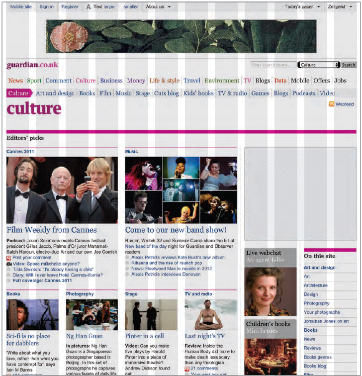
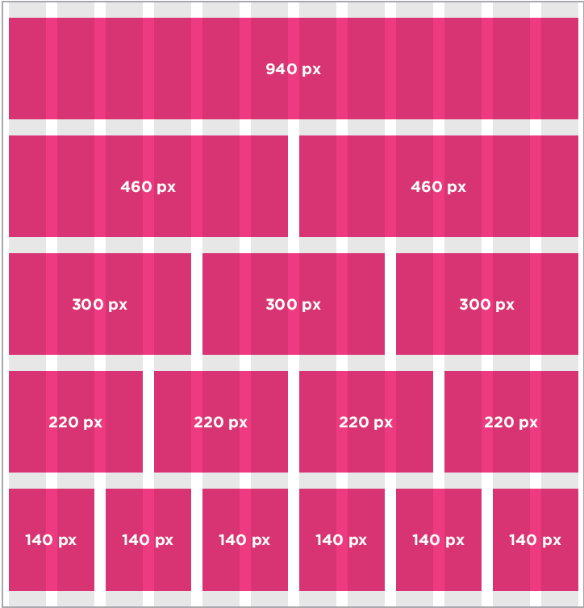
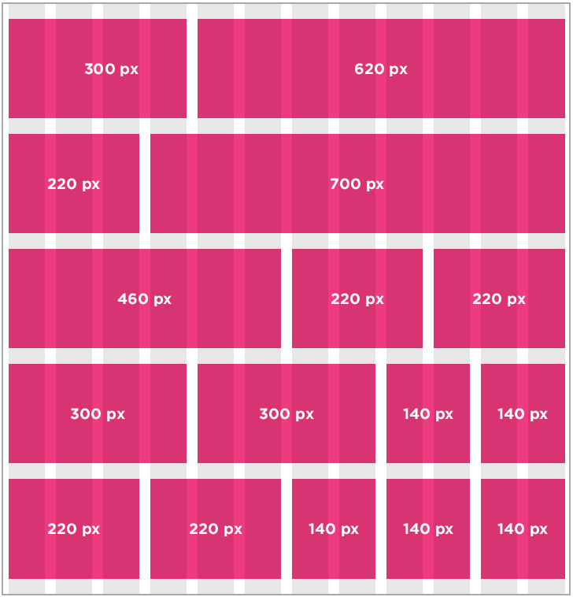

# **Summary: *Layout***

- `
` elements are often used as containing elements
to group together sections of a page.

- Browsers display pages in normal flow unless you
specify `relative`, `absolute`, or `fixed` positioning.

- The `float` property moves content to the left or right
of the page and can be used to create multi-column
layouts. (Floated items require a defined width.)

- Pages can be fixed width or liquid (stretchy) layouts.

- Designers keep pages within 960-1000 pixels wide,
and indicate what the site is about within the top 600
pixels (to demonstrate its relevance without scrolling).

- Grids help create professional and flexible designs.

- CSS Frameworks provide rules for common tasks.

- You can include multiple CSS files in one page.
---

## Key Concepts in Positioning Elements

### Building Blocks

CSS treats each HTML element as if it is in its own box. This box will either be a block-level
box or an inline box.

Block-level boxes start on a new line and act as the main building blocks
of any layout, while inline boxes flow between surrounding text. You can
control how much space each box takes up by setting the width of the
boxes (and sometimes the height, too). To separate boxes, you can use
borders, margins, padding, and background colors.

- **Block-level elements** start on a new line
Examples include: `<h1>` `
` `<ul>` `<li>`

- **Inline elements** flow in between surrounding text
Examples include:
`` `<b>` `<i>`

### Containing Elements

If one block-level element sits inside another block-level element then the outer box is known as the containing or `parent` element.

It is common to group a number of elements together inside a `
` (or other block-level) element. For example, you might group together all of the elements that form the header of a site (such as the logo and
the main navigation). The `
` element that contains this group of elements is then referred to as the containing element.

A box may be nested inside several other block-level elements. The containing
element is always the direct parent of that element.

# Controlling the Position of Elements

CSS has the following **positioning schemes** that allow you to control the layout of a page: normal flow, relative positioning, and absolute positioning. You specify the positioning scheme using the position property in CSS. You can also float elements using the float property.

To indicate where a box should be positioned, you may also need to use `box offset` properties to tell the browser how far from the top or bottom and left or right it should be placed. 

## Normal Flow

Every block-level element appears on a new line, causing each item to appear lower down
the page than the previous one.

Even if you specify the width of the boxes and there is space for two elements to sit side-by side, they will not appear next
to each other. This is the default behavior (unless you tell the browser to do something else).

## Relative Positioning

This moves an element from the position it would be in normal flow, shifting it to the top, right, bottom, or left of where it would have been placed. 

This does not affect the position of surrounding elements; they stay in the position they would be in in normal flow.

## Absolute Positioning

This positions the element in relation to its containing element. It is taken out of normal flow, meaning that it does not affect the position of any surrounding elements (as they simply ignore the space it would have taken up).

Absolutely positioned elements move as users scroll up and down the page.

## Fixed Positioning

This is a form of absolute positioning that positions the element in relation to the
browser window, as opposed to the containing element.

Elements with fixed positioning do not affect the position of surrounding elements and they do not move when the user scrolls up or down the page.

## Floating Elements

Floating an element allows you to take that element out of normal flow and position it to the far left or right of a containing box. The floated element becomes a block-level element around which other content can flow.

---

When you move any element from
normal flow, boxes can overlap. The
`z-index` property allows you to control
which box appears on top.

---

# Screen Sizes

Different visitors to your site will have different sized screens that show different amounts of information, so your design needs to be able to work on a range of different sized screens.

When designing for print, you always know the size of the
piece of paper that your design will be printed on. However,
when it comes to designing for the web, you are faced with the
unique challenge that different users will have different sized
screens.

Since computers have been sold to the public, the size of screens
has been steadily increasing. This means that some people
viewing your site might have 13 inch monitors while others may
have 27+ inch monitors.

The size of a user's screen affects how big they can open
their windows and how much of the page they will see. There
are also an increasing number of handheld devices (mobile
phones and tablets) that have smaller screens.

## Screen Resolution

Resolution refers to the number of dots a screen shows per inch. Some devices have a higher resolution than desktop computers and most operating systems allow users to adjust the resolution of their screens.

Most computers will allow owners to adjust the resolution
of the display or the number of pixels that are shown on the
screen. For example, here you can see the options to change
the screen size from 720 x 480 pixels up to 1280 x 800 pixels.

It is interesting to note that the higher the resolution, the
smaller the text appears. Many mobile devices have screens
that are higher resolution than their desktop counterparts.

|Device|Size|Resolution|
|------|----|----------|
|iPhone4|3.5 inches|960 x 640 Pixels|
|iPad2| 9.7 inches | 1024 x 768 Pixels|
|13" MacBook|13.3 inches| 1280 x 800 Pixels|
|27" iMac | 27 inches | 2560 x 1440 Pixels|

# Page Sizes

Because screen sizes and display resolutions vary so much, web
designers often try to create pages of around 960-1000 pixels wide
(since most users will be able to see designs this wide on their screens).

Judging the height that peopleare likely to see on the screen
without scrolling down the page is much harder. For several
years, designers assumed that users would see the top 570-
600 pixels of a page without having to scroll and some tried
to fit all of the key messages in this area (fearing that people
would not scroll down the page).

As screen sizes have increased and handheld devices have
become more popular, the area users will see is far more
variable.

The area of the page that users would see without scrolling was
often referred as being "above the fold" (a term newspapers
had originally coined to describe the area of the front page you
would see if the paper were folded in half).

It is now recognized that if someone is interested in the
content of the page, they are likely to scroll down to see more.

Having said which, usability studies have shown that visitors
can judge a page in under a second so it is still important to
let new visitors know that the site is relevant to them and their
interests.

As a result, many designs still try to let the user know what the
site is about within the top 570- 600 pixels, as well as hint at
more content below this point. But do not try to cram too much into that top area.

The shaded area is hidden by the constraints of the browser
window, so the user must scroll in order to view the lower region.

However, the user gets a taste for what is lower on the page
and can tell that there will be more to see if they scroll down.

# Fixed Width Layouts

Fixed width layout designs do not change size as the user increases
or decreases the size of their browser window. Measurements tend to be given in pixels.

|Advantages|Disadvantages|
|----------|-------------|
|Pixel values are accurate at controlling size and positioning of elements. | You can end up with big gaps around the edge of a page. 
| The designer has far greater control over the appearance and position of items on the page than with liquid layouts. | If the user's screen is a much higher resolution than the designer's screen, the page can look smaller and text can be harder to read.
| You can control the lengths of lines of text regardless of the size of the user's window. | If a user increases font sizes, text might not fit into the allotted spaces.
| The size of an image will always remain the same relative to the rest of the page. | The design works best on devices that have a site or resolution similar to that of desktop or laptop computers. 
|  | The page will often take up more vertical space than a liquid layout with the same content.

# Liquid Layouts

Liquid layout designs stretch and contract
as the user increases or decreases the
size of their browser window. They tend to
use percentages.

|Advantages|Disadvantages|
|----------|-------------|
| Pages expand to fill the entire browser window so there are no spaces around the page on a large screen. | If you do not control the width of sections of the page then the design can look very different than you intended, with unexpected gaps around certain elements or items squashed together.
| If the user has a small window, the page can contract to fit it without the user having to scroll to the side. | If the user has a wide window, lines of text can become very long, which makes them harder to read.
| The design is tolerant of users setting font sizes larger than the designer intended (because the page can stretch). | If the user has a very narrow window, words may be squashed and you can end up with few words on each line.
| | If a fixed width item (such as an image) is in a box that is too small to hold it (because the user has made the window smaller) the image can overflow over the text.

Because liquid layouts can stretch the entire width of the browser, resulting in long lines
of text that are hard to read, some liquid layouts only let part of the page expand and contract.

Other parts of the page have minimum and maximum widths.

# Layout Grids

Composition in any visual art (such as design, painting, or photography) is the placement or arrangement of visual elements — how they are organized on a page. Many designers use a grid structure to help them position items on a page, and the same is true for web designers.

Below, you can see a set of
thick vertical lines superimposed
over the top of a newspaper
website to show you how the
page was designed according to
a grid. 

This grid is called the **960
pixel grid** and is widely used by
web designers.

Grids set consistent proportions
and spaces between items which
helps to create a professional
looking design.

It is possible to create many
different layouts using this one
versatile grid.

While a grid might seem like a
restriction, in actual fact it:

- Creates a continuity between
different pages which may
use different designs
- Helps users predict where to
find information on various
pages
- Makes it easier to add new
content to the site in a
consistent way
- Helps people collaborate
on the design of a site in a
consistent way

Possible Layouts:

- 960 Pixel wide, 12 Column Grid

Above images illustrate a 960
pixel wide, 12 column grid. 

They demonstrate how it is possible
to create a wide range of column
layouts using this one grid.

The page is 960 pixels wide and
there are 12 equal sized columns
(shown in gray), each of which is
is 60 pixels wide.

Each column has a margin set
to 10 pixels, which creates a
gap of 20 pixels between each
column and 10 pixels to the left
and right-hand sides of the page.

