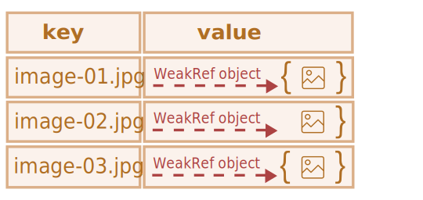

# Summary | WeakRef and FinalizationRegistry

`WeakRef` - designed to create weak references to objects, allowing them to be deleted from memory by the garbage collector if there are no longer strong references to them.
This is beneficial for addressing excessive memory usage and optimizing the utilization of system resources in applications.

`FinalizationRegistry` - is a tool for registering callbacks, that are executed when objects that are no longer strongly referenced, are destroyed.
This allows releasing resources associated with the object or performing other necessary operations before deleting the object from memory.

#### **Warning** "hidden" features of the language

This article covers a very narrowly focused topic, that most developers extremely rarely encounter in practice (and may not even be aware of its existence).  

We recommend skipping this chapter if you have just started learning JavaScript.

---

Recalling the basic concept of the *reachability principle* from the garbage collection chapter (under Objects), we can note that the JavaScript engine is guaranteed to keep values in memory that are accessible or in use.

For example:

```js
//  the user variable holds a strong reference to the object
let user = { name: "John" };

// let's overwrite the value of the user variable
user = null;

// the reference is lost and the object will be deleted from memory

```

Or a similar, but slightly more complicated code with two strong references:

```js
//  the user variable holds a strong reference to the object
let user = { name: "John" };

// copied the strong reference to the object into the admin variable
*!*
let admin = user;
*/!*

// let's overwrite the value of the user variable
user = null;

// the object is still reachable through the admin variable
```
The object `{ name: "John" }` would only be deleted from memory if there were no strong references to it (if we also overwrote the value of the `admin` variable).

In JavaScript, there is a concept called `WeakRef`, which behaves slightly differently in this case.

---

#### Terms: **Strong reference**, **Weak reference**

**Strong reference** - is a reference to an object or value, that prevents them from being deleted by the garbage collector. Thereby, keeping the object or value in memory, to which it points.  

This means, that the object or value remains in memory and is not collected by the garbage collector as long, as there are active strong references to it.  

In JavaScript, ordinary references to objects are strong references. For example:

```js
// the user variable holds a strong reference to this object
let user = { name: "John" };
```

**Weak reference** - is a reference to an object or value, that does *not* prevent them from being deleted by the garbage collector.
An object or value can be deleted by the garbage collector if, the only remaining references to them are weak references.

## WeakRef

#### Note of caution

Before we dive into it, it is worth noting that the correct use of the structures discussed in this article requires very careful thought, and they are best avoided if possible. 

`WeakRef` - is an object, that contains a weak reference to another object, called `target` or `referent`. 

The peculiarity of `WeakRef` is that it does not prevent the garbage collector from deleting its referent-object. In other words, a `WeakRef` object does not keep the `referent` object alive.  

Now let's take the `user` variable as the "referent" and create a weak reference from it to the `admin` variable.
To create a weak reference, you need to use the `WeakRef` constructor, passing in the target object (the object you want a weak reference to).

In our case — this is the `user` variable:


```js
//  the user variable holds a strong reference to the object
let user = { name: "John" };

//  the admin variable holds a weak reference to the object
*!*
let admin = new WeakRef(user);
*/!*

```

The diagram below depicts two types of references: a strong reference using the `user` variable and a weak reference using the `admin` variable:

  

Then, at some point, we stop using the `user` variable - it gets overwritten, goes out of scope, etc., while keeping the `WeakRef` instance in the `admin` variable:

```js
// let's overwrite the value of the user variable
user = null;
```

A weak reference to an object is not enough to keep it "alive". When the only remaining references to a referent-object are weak references, the garbage collector is free to destroy this object and use its memory for something else.

However, until the object is actually destroyed, the weak reference may return it, even if there are no more strong references to this object.
That is, our object becomes a kind of "[Schrödinger's cat](https://en.wikipedia.org/wiki/Schr%C3%B6dinger%27s_cat)" – we cannot know for sure whether it's "alive" or "dead":


At this point, to get the object from the `WeakRef` instance, we will use its `deref()` method.  

The `deref()` method returns the referent-object that the `WeakRef` points to, if the object is still in memory. If the object has been deleted by the garbage collector, then the `deref()` method will return `undefined`:

```js
let ref = admin.deref();

if (ref) {
  // the object is still accessible: we can perform any manipulations with it
} else {
  // the object has been collected by the garbage collector
}
```

## WeakRef use cases

`WeakRef` is typically used to create caches or [associative arrays](https://en.wikipedia.org/wiki/Associative_array) that store resource-intensive objects.
This allows one to avoid preventing these objects from being collected by the garbage collector solely based on their presence in the cache or associative array.  

One of the primary examples - is a situation when we have numerous binary image objects (for instance, represented as `ArrayBuffer` or `Blob`), and we want to associate a name or path with each image.
Existing data structures are not quite suitable for these purposes:

- Using `Map` to create associations between names and images, or vice versa, will keep the image objects in memory since they are present in the `Map` as keys or values.
- `WeakMap` is ineligible for this goal either: because the objects represented as `WeakMap` keys use weak references, and are not protected from deletion by the garbage collector.

But, in this situation, we need a data structure that would use weak references in its values.

For this purpose, we can use a `Map` collection, whose values are `WeakRef` instances referring to the large objects we need.
Consequently, we will not keep these large and unnecessary objects in memory longer than they should be.  

Otherwise, this is a way to get the image object from the cache if it is still reachable.
If it has been garbage collected, we will re-generate or re-download it again.  

This way, less memory is used in some situations.  

## Example 1: using WeakRef for caching

Below is a code snippet that demonstrates the technique of using `WeakRef`.  

In short, we use a `Map` with string keys and `WeakRef` objects as their values.
If the `WeakRef` object has not been collected by the garbage collector, we get it from the cache.
Otherwise, we re-download it again and put it in the cache for further possible reuse:  

```js
function fetchImg() {
    // abstract function for downloading images...
}

function weakRefCache(fetchImg) { // (1)
    const imgCache = new Map(); // (2)

    return (imgName) => { // (3)
        const cachedImg = imgCache.get(imgName); // (4)

        if (cachedImg?.deref()) { // (5)
            return cachedImg?.deref();
        }

        const newImg = fetchImg(imgName); // (6)
        imgCache.set(imgName, new WeakRef(newImg)); // (7)

        return newImg;
    };
}

const getCachedImg = weakRefCache(fetchImg);
```

Let's delve into the details of what happened here:
1. `weakRefCache` - is a higher-order function that takes another function, `fetchImg`, as an argument. In this example, we can neglect a detailed description of the `fetchImg` function, since it can be any logic for downloading images.
2. `imgCache` - is a cache of images, that stores cached results of the `fetchImg` function, in the form of string keys (image name) and `WeakRef` objects as their values.
3. Return an anonymous function that takes the image name as an argument. This argument will be used as a key for the cached image.
4. Trying to get the cached result from the cache, using the provided key (image name).
5. If the cache contains a value for the specified key, and the `WeakRef` object has not been deleted by the garbage collector, return the cached result.
6. If there is no entry in the cache with the requested key, or `deref()` method returns `undefined` (meaning that the `WeakRef` object has been garbage collected), the `fetchImg` function downloads the image again.
7. Put the downloaded image into the cache as a `WeakRef` object.  

Now we have a `Map` collection, where the keys - are image names as strings, and values - are `WeakRef` objects containing the images themselves.

This technique helps to avoid allocating a large amount of memory for resource-intensive objects, that nobody uses anymore.
It also saves memory and time in case of reusing cached objects.

Here is a visual representation of what this code looks like:  

 

But, this implementation has its drawbacks: over time, `Map` will be filled with strings as keys, that point to a `WeakRef`, whose referent-object has already been garbage collected:  


One way to handle this problem - is to periodically scavenge the cache and clear out "dead" entries.
Another way - is to use finalizers, which we will explore next.  

## Example 2: Using WeakRef to track DOM objects

Another use case for `WeakRef` - is tracking DOM objects.  

Let's imagine a scenario where some third-party code or library interacts with elements on our page as long as they exist in the DOM.
For example, it could be an external utility for monitoring and notifying about the system's state (commonly so-called "logger" – a program that sends informational messages called "logs").

See **weakref-dom** for the interactive example.

When the "Start sending messages" button is clicked, in the so-called "logs display window" (an element with the `.window__body` class), messages (logs) start to appear.  

But, as soon as this element is deleted from the DOM, the logger should stop sending messages.
To reproduce the removal of this element, just click the "Close" button in the top right corner.  

In order not to complicate our work, and not to notify third-party code every time our DOM-element is available, and when it is not, it will be enough to create a weak reference to it using `WeakRef`.    

Once the element is removed from the DOM, the logger will notice it and stop sending messages.

Now let's take a closer look at the source code `/weakref-dom/index.js`:

```js
const startMessagesBtn = document.querySelector('.start-messages'); // (1)
const closeWindowBtn = document.querySelector('.window__button'); // (2)
const windowElementRef = new WeakRef(document.querySelector(".window__body")); // (3)

startMessagesBtn.addEventListener('click', () => { // (4)
    startMessages(windowElementRef);
    startMessagesBtn.disabled = true;
});

closeWindowBtn.addEventListener('click', () =>  document.querySelector(".window__body").remove()); // (5)


const startMessages = (element) => {
    const timerId = setInterval(() => { // (6)
        if (element.deref()) { // (7)
            const payload = document.createElement("p");
            payload.textContent = `Message: System status OK: ${new Date().toLocaleTimeString()}`;
            element.deref().append(payload);
        } else { // (8)
            alert("The element has been deleted."); // (9)
            clearInterval(timerId);
        }
    }, 1000);
};
```