# Debugging in the Browser

    Debugging is the process of finding and fixing errors within a script. All modern browsers and most other environments support debugging tools – a special UI in developer tools that makes debugging much easier. It also allows to trace the code step by step to see what exactly is going on.

> Note: Will be using Chrome to demonstrate. 

---

## **Sources** Panel

1. Open up the <a href= https://javascript.info/article/debugging-chrome/debugging/index.html > Example Page </a> in Chrome
    - Alternative link to example page can be found in the same directory as this named "debugging-chrome.html"
2. Turn on developer tools
    - Press `[F12]` 
    - `[Ctrl + Shift + I]` also works 
    - `[Cmd + Opt + I]` on Mac
3. Select the **Sources** Panel

What the `Sources` Panel should look like with the Navigator Button toggled Off (hidden):

In the Top Left we can see:

The Navigator Button is: 

What `Sources` Panel looks like when Navigator Button is toggled On:

### Sources panel has 3 parts:

1. On the left, the **File Navigator** pane lists HTML, JavaScript, CSS and other files, including images that are attached to the page. Chrome extensions may appear here too.

2. In the middle, the **Code Editor** pane shows the source code.

3. On the right, the **JavaScript Debugging pane** is for debugging

***

## **Console**

If we press `[Esc]`, then a console opens below. We can type commands there and press `[Enter]` to execute. 

After a statement is executed, its result is shown below. For example, here `1+2` results in `3`, while the function call `hello("debugger")` returns nothing, so the result is `undefined`:

---

## **Breakpoints**

- Let's examine the code within the <a href= https://javascript.info/article/debugging-chrome/debugging/index.html > example page </a>
- In `Sources` panel go the the left on the **File Navigator** pane and click on **hello.js**
- Go to the middle in the **Code Editor**, and click at line number `4`. 
    - Yes, right on the ***4*** digit, not on the code.
- Now click on the number for line `8`.

It should look like this (blue is where you should click): 

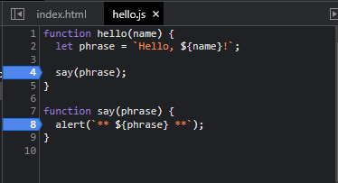

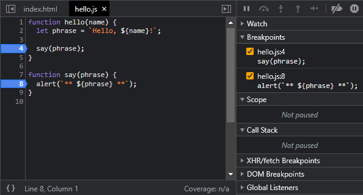

*Notice*: Line 4 and Line 8 is highlighted blue, and it has been added to the right in the **JavaScript Debugging pane** under breakpoints.

A ***breakpoint*** is a point of code where the debugger will automatically pause the JavaScript execution.

While the code is paused, we can examine current variables, execute commands in the console etc. In other words, we can debug it.

We can always find a list of breakpoints in the right panel. That’s useful when we have many breakpoints in various files. It allows us to:

- Quickly jump to the breakpoint in the code (by clicking on it in the right panel).
- Temporarily disable the breakpoint by unchecking it.
- Remove the breakpoint by right-clicking and selecting Remove.

> **Conditional Breakpoints** 
- *Right click* on the line number allows to create a **conditional breakpoint**. 
- It only triggers when the given expression, that you should provide when you create it, is truthy.
- That's handy when we need to stop only for a certain variable value or for certain function parameters.

---

## **The command "debugger"**

We can also pause the code by using the `debugger` command in it, like this: 

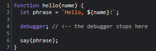

Such a command works only when the development tools are open, otherwise the browser ignores it.

---

## **Pause and Look Around**

In our example, `hello()` is called during the page load, so the easiest way to activate the debugger (after we’ve set the breakpoints) is to reload the page.
    - Press `[F5]` on Windows or Linux
    - Press `[Cmd+R]` on Mac

As the breakpoint is set, the execution pauses at the 4th line:

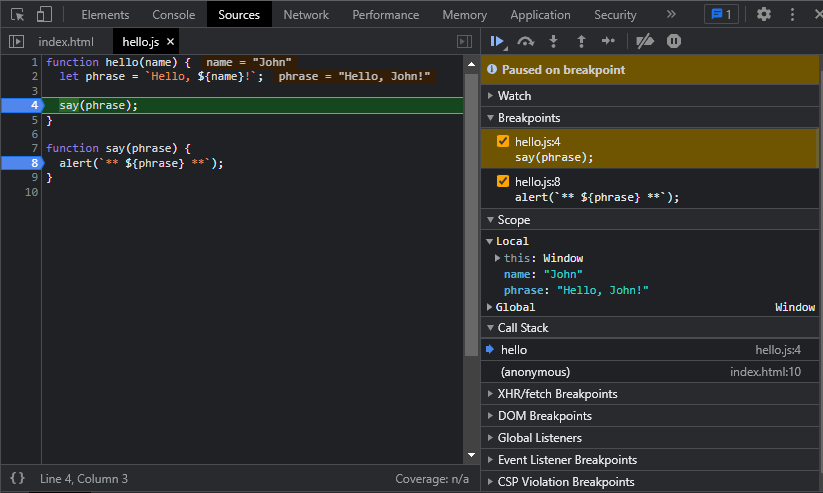

In **JavaScript Debugging** pane, the informational dropdowns to the right (labeled with arrows) allow you to examine the current code state:

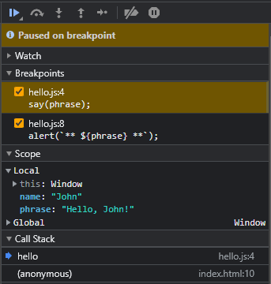

1. `Watch` **shows current values for any expressions**
    - You can click the plus `+` and input an expression. The debugger will show its value, automatically recalculating it in the process of execution.

2. `Call Stack` **shows the nested calls chain**
    - At the current moment the debugger is inside `hello()` call, called by a script in `index.html` (no function there, so it’s called "anonymous").
    - If you click on a stack item (e.g. 
    "anonymous"), the debugger jumps to the corresponding code, and all its variables can be examined as well.

3. `Scope` **current variables**
    - `Local` **shows local function variables.** You can also see their values highlighted right over the source.
    - `Global` **has global variables** (out of any functions)
    - There's also `this` keyword

--- 

## **Tracing the Execution**

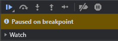

Now it’s time to ***trace*** the script, using the buttons at the top of the right panel. Let’s engage them.

### ***Resume* - continues the execution**

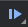

* Hotkeys: `[F8]` or `[Ctrl + \]`
* Resumes the execution. If there are no additional breakpoints, then the execution just continues and the debugger loses control.

Here’s what we can see after a click on it:

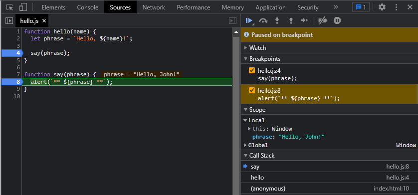

* The execution has resumed, reached another breakpoint inside `say()` and paused there. 
* Take a look at the **Call Stack** at the right. It has increased by one more call. We're inside `say()` now.

### ***Step* - run the next command**
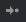

* Hotkeys: `[F9]`
* Run the next statement. If we click it now, `alert` will be shown.
* Clicking this again and again will step through all script statements one by one.

### ***Step Over* - runs the next command, but *don't go into a function***
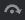

* Hotkeys: `[F10]` or `[Ctrl + ']`
* Similar to the previous `Step` command, but behaves differently if the next statement is a function call (not a built-in, like `alert`, but a function of our own)
* "Step" vs. "Step Over" comparison
    1. `Step` command goes into a nested function call and pauses the execution at its first line, 
    2. `Step over` executes the nested function call invisibly to us, skipping the function internals.
- Execution is then paused immediately after that function call
- That's good if we're not interested to see what happens inside the function call

### ***Step Into* - runs the next command, but *behaves differently in case of asynchronous function calls***

* Hotkeys: `[F11]` or `[Ctrl + ;]`
* That’s similar to `Step`, but behaves differently in case of asynchronous function calls.
* "Step" vs. "Step Into" comparison
    1. `Step` command ignores async actions, such as `setTimeout` (scheduled function call), that execute later. 
    2. `Step into` goes into their code, waiting for them if necessary.

### ***Step Out* - continue the execution till the end of the current function**

* Hotkeys: `[Shift + F11]` or `[Ctrl + Shift + ;]`
* Continue the execution and stop it at the very last line of the current function. 
* That’s handy when we accidentally entered a nested call using `Step`  , but it does not interest us, and we want to continue to its end as soon as possible.

### **Enable/Disable *all Breakpoints***
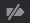

* Hotkeys: `[Ctrl + F8]`
* This button does not move the execution. 
* Just a mass on/off for breakpoints.

### **Enable/Disable *automatic pause* in case of error**

* When enabled, if the developer tools is open, an error during the script execution automatically pauses it.
* Then we can analyze variables in the debugger to see what went wrong. 
- So if our script dies with an error, we can open debugger, enable this option and reload the page to see where it dies and what’s the context at that moment.

### **Continue to Here**

* Right Click on a line of code opens the context menu with a great option called *Continue to here*.
* Handy when we want ot move multiple steps forward to the line, but we're too lazy to set a break point

---

## **Logging**

`console.log` - function outputs something to console from our code. 

For instance, this outputs values from `0` to `7` to console: 
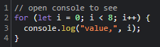

Output in Console:
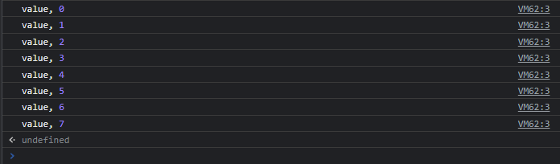

Since it is in the console, regular users don't see that output. 

To see it, either open the Console panel of developer tools or press `[Esc]` while in another panel: that opens the console at the bottom.

If we have enough logging in our code, then we can see what’s going on from the records, without the debugger.

---

# Summary

3 main ways to pause a script:

1. A Breakpoint
2. The `debugger` statements
3. An error 
    * If dev tools are open and the button  is turned On. 

When paused, we can debug: examine variables and trace the code to see where the execution goes wrong. 

There are many more options in developer tools than covered here. See the <a href="https://developers.google.com/web/tools/chrome-devtools">full manual for Google Chrome</a>.

Fastest route to learn dev tools is to click various places of dev tools and just see what's showing up. 

