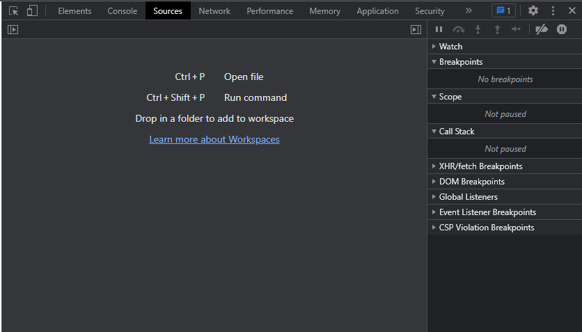
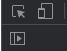
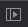
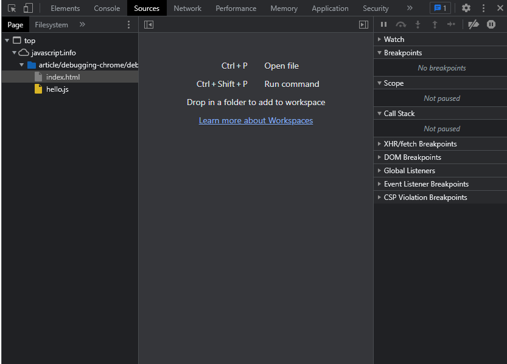
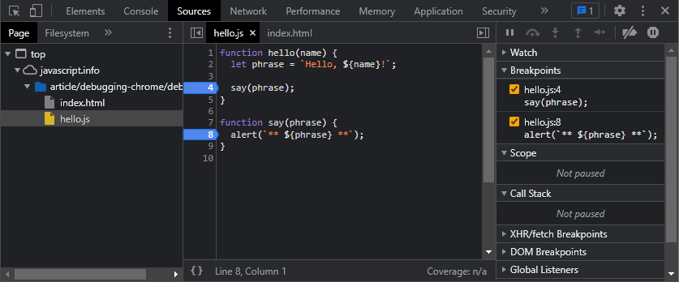

# Debugging in the Browser

    Debugging is the process of finding and fixing errors within a script. All modern browsers and most other environments support debugging tools – a special UI in developer tools that makes debugging much easier. It also allows to trace the code step by step to see what exactly is going on.

> Note: Will be using Chrome to demonstrate. 

---

## **Sources** Panel

1. Open up the <a href= https://javascript.info/article/debugging-chrome/debugging/index.html > Example Page </a> in Chrome
    - Alternative link to example page can be found in the same directory as this named "debugging-chrome.html"
2. Turn on developer tools
    - Press `[F12]` 
    - `[Ctrl + Shift + I]` also works 
    - `[Cmd + Opt + I]` on Mac
3. Select the **Sources** Panel

What the `Sources` Panel should look like with the Navigator Button toggled Off (hidden):

In the Top Left we can see:

The Navigator Button is: 

What `Sources` Panel looks like when Navigator Button is toggled On:

### Sources panel has 3 parts:

1. On the left, the **File Navigator** pane lists HTML, JavaScript, CSS and other files, including images that are attached to the page. Chrome extensions may appear here too.

2. In the middle, the **Code Editor** pane shows the source code.

3. On the right, the **JavaScript Debugging pane** is for debugging

***

## Console

If we press `[Esc]`, then a console opens below. We can type commands there and press `[Enter]` to execute. 

After a statement is executed, its result is shown below. For example, here `1+2` results in `3`, while the function call `hello("debugger")` returns nothing, so the result is `undefined`:

---

## Breakpoints

- Let's examine the code within the <a href= https://javascript.info/article/debugging-chrome/debugging/index.html > example page </a>
- In `Sources` panel go the the left on the **File Navigator** pane and click on **hello.js**
- Go to the middle in the **Code Editor**, and click at line number `4`. 
    - Yes, right on the ***4*** digit, not on the code.
- Now click on the number for line `8`.

It should look like this (blue is where you should click): 

*Notice*: Line 4 and Line 8 is highlighted blue, and it has been added to the right in the **JavaScript Debugging pane** under breakpoints.

A ***breakpoint*** is a point of code where the debugger will automatically pause the JavaScript execution.

While the code is paused, we can examine current variables, execute commands in the console etc. In other words, we can debug it.

We can always find a list of breakpoints in the right panel. That’s useful when we have many breakpoints in various files. It allows us to:

- Quickly jump to the breakpoint in the code (by clicking on it in the right panel).
- Temporarily disable the breakpoint by unchecking it.
- Remove the breakpoint by right-clicking and selecting Remove.

> **Conditional Breakpoints** 
- *Right click* on the line number allows to create a **conditional breakpoint**. 
- It only triggers when the given expression, that you should provide when you create it, is truthy.
- That's handy when we need to stop only for a certain variable value or for certain function parameters.

---

