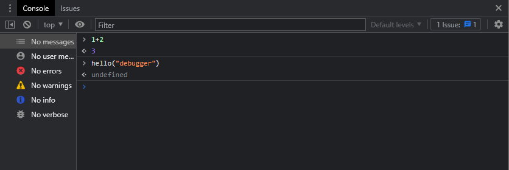

# Debugging in the Browser

    Debugging is the process of finding and fixing errors within a script. All modern browsers and most other environments support debugging tools – a special UI in developer tools that makes debugging much easier. It also allows to trace the code step by step to see what exactly is going on.

> Note: Will be using Chrome to demonstrate. 

---

## **Sources** Panel

1. Open up the <a href= https://javascript.info/article/debugging-chrome/debugging/index.html > Example Page </a> in Chrome
    - Alternative link to example page can be found in the same directory as this named "debugging-chrome.html"
2. Turn on developer tools
    - Press `[F12]` 
    - `[Ctrl + Shift + I]` also works 
    - `[Cmd + Opt + I]` on Mac
3. Select the **Sources** Panel

What the `Sources` Panel should look like with the Navigator Button toggled Off (hidden):

In the Top Left we can see:

The Navigator Button is: 

What `Sources` Panel looks like when Navigator Button is toggled On:

### Sources panel has 3 parts:

1. On the left, the **File Navigator** pane lists HTML, JavaScript, CSS and other files, including images that are attached to the page. Chrome extensions may appear here too.

2. In the middle, the **Code Editor** pane shows the source code.

3. On the right, the **JavaScript Debugging pane** is for debugging

***

## Console

If we press `[Esc]`, then a console opens below. We can type commands there and press `[Enter]` to execute. 

After a statement is executed, its result is shown below. For example, here `1+2` results in `3`, while the function call `hello("debugger")` returns nothing, so the result is `undefined`:

---

## Breakpoints

