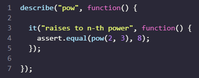
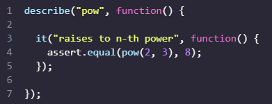
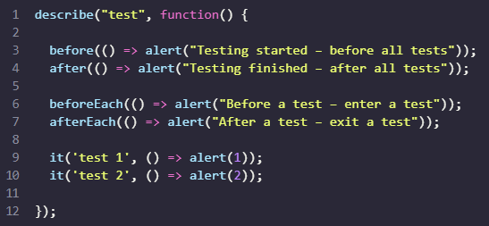

# Automated Testing with Mocha

**When testing a code by manual re-runs, it’s easy to miss something.**

**Automated testing means that tests are written separately, in addition to the code. They run our functions in various ways and compare results with the expected.**

---

# Behavior Driven Development (BDD)

    BDD is three things in one: tests AND documentation AND examples.

## **Development of *pow*: the spec**

Let’s say we want to make a `function pow(x, n)` that raises `x` to an integer power `n`. We assume that `n≥0`.

That task is just an example: there’s the `**` operator in JavaScript that can do that, but here we concentrate on the development flow that can be applied to more complex tasks as well.

### **Specification**

Before creating the code of pow, we can imagine what the function should do and describe it.

Such description is called a *specification* or, in short, a spec, and contains descriptions of use cases together with tests for them, like this: 

A spec has three main building blocks that you can see above:

1. `describe("title", function() { ... })`
    * What is the functionality we are describing?
    * Describing the function `pow`.
    * Used to group "workers" - i.e. `it` blocks

2. `it("use case description", function() { ... })`
    * In title of `it`, in a *human-readable* way, describe the particular use case
    * The second argument is a function that tests it

3. `assert.equal(value1, value2)`
    * code inside `it` block, if the implementation is correct, should execute without errors.

> Functions `assert.*` are used to check whether `pow` works as expected. Here we use `assert.equal()`, which compares arguments and yields an error if they are not equal. Here it checks that the result of `pow(2,3)` equals `8`.

The specification can be executed, and it will run the test specified in `it` block. 

---

## **The Development Flow**

The flow of development usually looks like this:

1. An initial spec is written, with tests for the most basic functionality.

2. An initial implementation is created.

3. To check whether it works, we run the testing framework <a href = "https://mochajs.org/"> Mocha </a> that runs the spec. 
    * While the functionality is not complete, errors are displayed. 
    * We make corrections until everything works.

4. Now we have a working initial implementation with tests.

5. We add more use cases to the spec, probably not yet supported by the implementations. Tests start to fail.

6. Go to 3, update the implementation till tests give no errors.

7. Repeat steps 3-6 till the functionality is ready.

#### Development is *iterative*
    We write the spec, implement it, make sure tests pass, then write more tests, make sure those tests pass, etc.

For our example: `pow` the initial spec has been made, so the first step is complete. 

Before making the implementation, let's use a few JavaScript libraries to run the tests, just to see that they are working. (*they will all fail*).

---

## **The spec in action**

* <a href="https://mochajs.org/">Mocha</a> – the core framework: it provides common testing functions including `describe` and `it` and the main function that runs tests.

* <a href="https://www.chaijs.com/">Chai</a>  – the library with many assertions. It allows to use a lot of different assertions, for now we need only assert.equal.

* <a href="https://sinonjs.org/">Sinon</a>  – a library to spy over functions, emulate built-in functions and more, we’ll need it much later.

The JavaScript libraries used here are suitable for both in-browser and server-side testing. Here we will consider the browser variant. 

### ***Creating the Specification***

* First, create an external script named `test.js`

Inside `test.js` we have our first test from earlier: 

* Next, create `testingJS.html` 
    
The full HTML page with these frameworks and `pow` spec: 

### The HTML page can be divided into 5 parts:

1. The `<head>` – add third-party libraries and styles for tests.
2. The `<script>` with the function to test, in our case – with the code for `pow`.
3. The tests – in our case an external script `test.js` that has `describe("pow", ...)` from above.
4. The HTML element `
` will be used by Mocha to output results.
5. The tests are started by the command `mocha.run()`.

### Open up the HTML page in a browser

The **result** by dragging `testingJS.html` to a new tab in Google Chrome (Version 108.0.5359.99 (Official Build) (64-bit)): 

* Test fails for now, because there's an error. 
* We have an empty function code in `pow`, so `pow(2,3)` returns `undefined` instead of `8`

> *Side Note*: There are more high-level test runners that make it easy to autorun many different tests. e.g. <a href="https://karma-runner.github.io/">karma</a>

***

## Initial Implementation of `pow`

* In `testingJS.html`, let's provide an initial implementation for `pow` located in the `<script>` right under `<body>` 

* Now open up `testingJS.html` in the browser again to see the new result:  which shows that the first test passed. 

## **Improving the specification**

Tests pass, but the function is erroneous. The spec is imperfect, as it needs more cases to further polish the function. 

The initial implementation of `pow` was a cheat that circumvents the first test. 

The function still does not work because an attempt to calculate `pow(3,4)` would give an incorrect result.

Let's add the test case `pow(3,4) = 81`

### Adding more Tests

We can select one of two ways to organize the test here: 

1. **Add one more `assert` into the same `it`**: 

2. **Make another test**:

The principal difference is that when `assert` triggers an error, the `it` block immediately terminates. 

> So, in the first variant if the first assert fails, then we’ll never see the result of the second assert.

Making tests separate is useful to get more information about what’s going on, so the second variant is better.

And besides that, there’s one more rule that’s good to follow.

***One test checks one thing.***

If we look at the test and see two independent checks in it, it’s better to split it into two simpler ones.

> So let’s continue with the second variant. Add the code to `test.js`

Result:  As expected, the second test failed since the function always returns `8`, while the `assert` expects `81`. 

---

## **Improving the Implementation**

* Let's improve the function `pow` inside `testingJS.html` so it can pass more tests: 

Testing the function with more values ensures it works well.

* Instead of writing `it` blocks manually, we can generate them in `for`. 

* Add the following to `test.js` 

Result of `testingJS.html`: 

---

## **Nested** `describe`

Note that the helper function `makeTest()` and `for` should be grouped together. 

We won't need `makeTest()` in other tests, it's needed only in `for` since their common task is to check how `pow` raises into the given power. 

Grouping is done with a **nested** `describe`. Add the following to `test.js` like so: 

The nested describe defines a new *subgroup* of tests. In the output we can see the titled indentation: 

In the future we can add more `it` and `describe` on the top level with helper functions of their own, they won't see `makeTest`.

---

### `before/after` *and* `beforeEach/afterEach`

* We can setup `before/after` functions that execute before/after running tests

* We can also setup `beforeEach/afterEach` functions that execture before/after ***every*** `it` 

* Usually, `before/after` *and* `beforeEach/afterEach` are used to perform initialization , zero out counters or do something else between the tests (or test groups)

For instance: 

The running sequence will be: 

You can run the example above in `beforeAfter.html` with external script `beforeAfterTest.js` located in the same directory.

---
