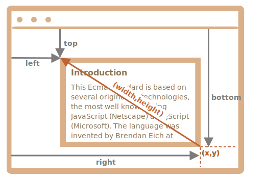

# Coordinates

## Summary

Any point on the page has coordinates:

1. Relative to the window -- `elem.getBoundingClientRect()`.
2. Relative to the document -- `elem.getBoundingClientRect()` plus the current page scroll.

Window coordinates are great to use with `position:fixed`, and document coordinates do well with `position:absolute`.

Both coordinate systems have their pros and cons; there are times we need one or the other one, just like CSS `position` `absolute` and `fixed`.

---

To move elements around we should be familiar with coordinates.

Most JavaScript methods deal with one of two coordinate systems:

1. **Relative to the window** - similar to `position:fixed`, calculated from the window top/left edge.
    - we'll denote these coordinates as `clientX/clientY`, the reasoning for such name will become clear later, when we study event properties.
2. **Relative to the document** - similar to `position:absolute` in the document root, calculated from the document top/left edge.
    - we'll denote them `pageX/pageY`.

When the page is scrolled to the very beginning, so that the top/left corner of the window is exactly the document top/left corner, these coordinates equal each other. But after the document shifts, window-relative coordinates of elements change, as elements move across the window, while document-relative coordinates remain the same.

On this picture we take a point in the document and demonstrate its coordinates before the scroll (left) and after it (right):

When the document scrolled:
- `pageY` - document-relative coordinate stayed the same, it's counted from the document top (now scrolled out).
- `clientY` - window-relative coordinate did change (the arrow became shorter), as the same point became closer to window top.

## Element coordinates: getBoundingClientRect

The method `elem.getBoundingClientRect()` returns window coordinates for a minimal rectangle that encloses `elem` as an object of built-in [DOMRect](https://www.w3.org/TR/geometry-1/#domrect) class.

Main `DOMRect` properties:

- `x/y` -- X/Y-coordinates of the rectangle origin relative to window,
- `width/height` -- width/height of the rectangle (can be negative).

Additionally, there are derived properties:

- `top/bottom` -- Y-coordinate for the top/bottom rectangle edge,
- `left/right` -- X-coordinate for the left/right rectangle edge.

For instance click this button to see its window coordinates:

<input id="brTest" type="button" value="Get coordinates using button.getBoundingClientRect() for this button" onclick='showRect(this)'/>

If you scroll the page and repeat, you'll notice that as window-relative button position changes, its window coordinates (`y/top/bottom` if you scroll vertically) change as well.

Here's the picture of `elem.getBoundingClientRect()` output:

As you can see, `x/y` and `width/height` fully describe the rectangle. Derived properties can be easily calculated from them:

- `left = x`
- `top = y`
- `right = x + width`
- `bottom = y + height`

Please note:

- Coordinates may be decimal fractions, such as `10.5`. That's normal, internally browser uses fractions in calculations. We don't have to round them when setting to `style.left/top`.
- Coordinates may be negative. For instance, if the page is scrolled so that `elem` is now above the window, then `elem.getBoundingClientRect().top` is negative.

### Why derived properties are needed? Why does `top/left` exist if there's `x/y`?

Mathematically, a rectangle is uniquely defined with its starting point `(x,y)` and the direction vector `(width,height)`. So the additional derived properties are for convenience.

Technically it's possible for `width/height` to be negative, that allows for "directed" rectangle, e.g. to represent mouse selection with properly marked start and end.

Negative `width/height` values mean that the rectangle starts at its bottom-right corner and then "grows" left-upwards.

Here's a rectangle with negative `width` and `height` (e.g. `width=-200`, `height=-100`):

As you can see, `left/top` do not equal `x/y` in such case.

In practice though, `elem.getBoundingClientRect()` always returns positive width/height, here we mention negative `width/height` only for you to understand why these seemingly duplicate properties are not actually duplicates.

### Internet Explorer: no support for `x/y`

Internet Explorer doesn't support `x/y` properties for historical reasons.

So we can either make a polyfill (add getters in `DomRect.prototype`) or just use `top/left`, as they are always the same as `x/y` for positive `width/height`, in particular in the result of `elem.getBoundingClientRect()`.

### Coordinates right/bottom are different from CSS position properties

There are obvious similarities between window-relative coordinates and CSS `position:fixed`.

But in CSS positioning, `right` property means the distance from the right edge, and `bottom` property means the distance from the bottom edge.

If we just look at the picture above, we can see that in JavaScript it is not so. All window coordinates are counted from the top-left corner, including these ones.

## elementFromPoint(x, y)