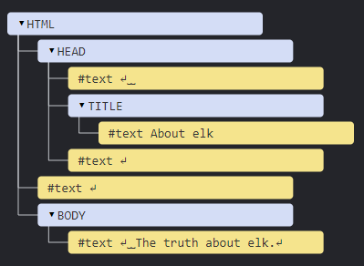

# **DOM tree**

The backbone of an HTML document is **tags**.

According to the **Document Object Model (DOM)**, every HTML tag is an object.

  * Nested tags are “children” of the enclosing one. 
  * The text inside a tag is an object as well.

All these objects are accessible using JavaScript, and we can use them to modify the page.

---

For example, `document.body` is the object representing the `<body>` tag.

Running this code will make the `<body>` red for 3 seconds:

```Javascript
document.body.style.background = 'red'; // make the background red

setTimeout(() => document.body.style.background = '', 3000); // return back
```

Here we used `style.background` to change the background color of `document.body`, but there are many other properties, such as:
  
  * `innerHTML` – HTML contents of the node.
  * `offsetWidth` – the node width (in pixels)
  * …and so on.

Soon we’ll learn more ways to manipulate the DOM, but first we need to know about its structure.

## **An example of the DOM**

Let's start with the following simple document:

```html
<!DOCTYPE HTML>
<html>
<head>
  <title>About elk</title>
</head>
<body>
  The truth about elk.
</body>
</html>
```

The DOM represents HTML as a tree structure of tags. 

Every tree node is an object.

Tags are element nodes (or just elements) and form the tree structure: `<html>` is at the root, then `<head>` and `<body>` are its children, etc.

The text inside elements forms text nodes, labelled as `#text`. A text node contains only a string. It may not have children and is always a leaf of the tree.

For instance, the `<title>` tag has the text `"About elk"`.

Please note the special characters in text nodes:

  * a newline: `↵` (in JavaScript known as `\n`)
  * a space: `␣`

Spaces and newlines are totally valid characters, like letters and digits. They form text nodes and become a part of the DOM. So, for instance, in the example above the `<head>` tag contains some spaces before `<title>`, and that text becomes a #text node (it contains a newline and some spaces only).