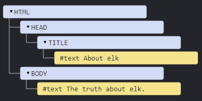
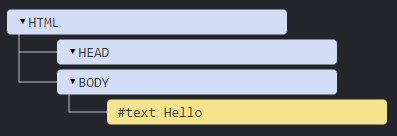
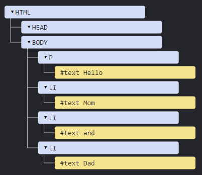
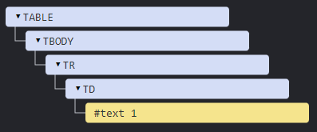
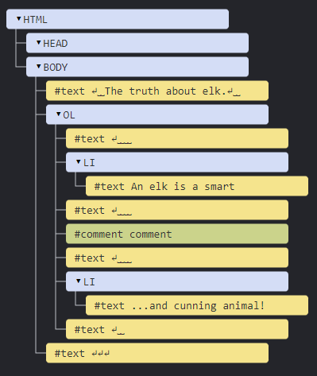

# **DOM tree**

The backbone of an HTML document is **tags**.

According to the **Document Object Model (DOM)**, every HTML tag is an object.

  * Nested tags are “children” of the enclosing one. 
  * The text inside a tag is an object as well.

All these objects are accessible using JavaScript, and we can use them to modify the page.

---

For example, `document.body` is the object representing the `<body>` tag.

Running this code will make the `<body>` red for 3 seconds:

```Javascript
document.body.style.background = 'red'; // make the background red

setTimeout(() => document.body.style.background = '', 3000); // return back
```

Here we used `style.background` to change the background color of `document.body`, but there are many other properties, such as:
  
  * `innerHTML` – HTML contents of the node.
  * `offsetWidth` – the node width (in pixels)
  * …and so on.

Soon we’ll learn more ways to manipulate the DOM, but first we need to know about its structure.

---

## **An example of the DOM**

Let's start with the following simple document:

```html
<!DOCTYPE HTML>
<html>
<head>
  <title>About elk</title>
</head>
<body>
  The truth about elk.
</body>
</html>
```

The DOM represents HTML as a tree structure of tags. 

Every tree node is an object.

Tags are element nodes (or just elements) and form the tree structure: `<html>` is at the root, then `<head>` and `<body>` are its children, etc.

The text inside elements forms text nodes, labelled as `#text`. A text node contains only a string. It may not have children and is always a leaf of the tree.

For instance, the `<title>` tag has the text `"About elk"`.

Please note the special characters in text nodes:

  * a newline: `↵` (in JavaScript known as `\n`)
  * a space: `␣`

Spaces and newlines are totally valid characters, like letters and digits. They form text nodes and become a part of the DOM. So, for instance, in the example above the `<head>` tag contains some spaces before `<title>`, and that text becomes a #text node (it contains a newline and some spaces only).

There are only two top-level exclusions:

  1. Spaces and newlines before `<head>` are ignored for historical reasons.
  
  2. If we put something after `</body>`, then that is automatically moved inside the body, at the end, as the HTML spec requires that all content must be inside `<body>`. So there can’t be any spaces after `</body>`.

In other cases everything’s straightforward – if there are spaces (just like any character) in the document, then they become text nodes in the DOM, and if we remove them, then there won’t be any.

Here are no space-only text nodes:

``` html
<!DOCTYPE HTML>
<html><head><title>About elk</title></head><body>The truth about elk.</body></html>
```



**Spaces at string start/end and space-only text nodes are usually hidden in tools**

Browser tools that work with DOM usually do not show spaces at the start/end of the text and empty text nodes (line-breaks) between tags.

Developer tools save screen space this way.

On further DOM pictures we’ll sometimes omit them when they are irrelevant. Such spaces usually do not affect how the document is displayed.

---

## **Autocorrection**

If the browser encounters malformed HTML, it automatically corrects it when making the DOM.

For instance, the top tag is always `<html>`. Even if it doesn’t exist in the document, it will exist in the DOM, because the browser will create it. The same goes for `<body>`.

As an example, if the HTML file is the single word "Hello", the browser will wrap it into `<html>` and `<body>`, and add the required `<head>`, and the DOM will be: 

While generating the DOM, browsers automatically process errors in the document, close tags and so on.

A document with unclosed tags: 

```html
<p>Hello
<li>Mom
<li>and
<li>Dad
```

…will become a normal DOM as the browser reads tags and restores the missing parts: 

### **Tables always have** `<tbody>`

An interesting “special case” is tables. By DOM specification they must have <tbody> tag, but HTML text may omit it. Then the browser creates <tbody> in the DOM automatically.

For the HTML:

```html
<table id="table"><tr><td>1</td></tr></table>
```

DOM-structure will be: 

See? The `<tbody>` appeared out of nowhere. We should keep this in mind while working with tables to avoid surprises.

--- 

## Other node types

There are some other node types besides elements and text nodes.

For example, comments:

```html
<!DOCTYPE HTML>
<html>
<body>
  The truth about elk.
  <ol>
    <li>An elk is a smart</li>
    <!-- comment -->
    <li>...and cunning animal!</li>
  </ol>
</body>
</html>
```


We can see here a new tree node type – comment node, labeled as `#comment`, between two text nodes.

We may think – why is a comment added to the DOM? It doesn’t affect the visual representation in any way. 

But there’s a rule – if something’s in HTML, then it also must be in the DOM tree.

**Everything in HTML, even comments, becomes a part of the DOM.**

Even the `<!DOCTYPE...>` directive at the very beginning of HTML is also a DOM node. It’s in the DOM tree right before `<html>`. Few people know about that. We are not going to touch that node, we even don’t draw it on diagrams, but it’s there.

The `document` object that represents the whole document is, formally, a DOM node as well.

> There are 12 <a href="https://dom.spec.whatwg.org/#node">node types</a>. In practice we usually work with 4 of them:
> 1. `document` – the “entry point” into DOM.
> 2. element nodes – HTML-tags, the tree building blocks.
> 3. text nodes – contain text.
> 4. comments – sometimes we can put information there, it won’t be shown, but JS can read it from the DOM.

--- 

## See DOM structure in real-time

