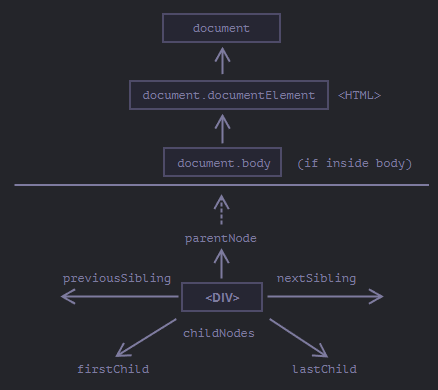

# Walking the DOM

## Summary

Given a DOM node, we can go to its immediate neighbors using navigation properties.

There are two main sets of them:

- For all nodes: `parentNode`, `childNodes`, `firstChild`, `lastChild`, `previousSibling`, `nextSibling`.

- For element nodes only: `parentElement`, `children`, `firstElementChild`, `lastElementChild`, `previousElementSibling`, `nextElementSibling`.

Some types of DOM elements, e.g. tables, provide additional properties and collections to access their content.

---

The DOM allows us to do anything with the elements and their contents, but first we need to reach the corresponding DOM object.

Al operations on the DOM start with the `document` object. That’s the main “entry point” to DOM. From it we can access any node.

Here’s a picture of links that allow for travel between DOM nodes: 

---

## **On top: documenttElement and body**

The topmost tree nodes are available directly as `document` properties:

1. `<html>` = `document.documentElement`
  *  The topmost document node is `document.documentElement`
  * That’s the DOM node of the `<html>` tag.

2. `<body>` = `document.body`

  * Another widely used DOM node is the `<body>` element – `document.body`

3. `<head>` = document.head
  * The `<head>` tag is available as `document.head`


> There's a catch `document.body` can be `null`
A script cannot access an element that doesn’t exist at the moment of running.

In particular, if a script is inside `<head>`, then `document.body` is unavailable, because the browser did not read it yet.

So, in the example below the first `alert` shows `null`:

```html
<html>

<head>
  <script>
    alert( "From HEAD: " + document.body ); // null, there's no <body> yet
  </script>
</head>

<body>

  <script>
    alert( "From BODY: " + document.body ); // HTMLBodyElement, now it exists
  </script>

</body>
</html>
```

> In the DOM world `null` means "doesn't exist"
> In the DOM, the `null` value means “doesn’t exist” or “no such node”.

---

## **Children: childNodes, firstChild, lastChild**

There are two terms that we’ll use from now on:
- **Child nodes (or children)** – elements that are direct children. In other words, they are nested exactly in the given one. For instance, `<head>` and `<body>` are children of `<html>` element.

- **Descendants** – all elements that are nested in the given one, including children, their children and so on.

For instance, here `<body>` has children `<div>` and `<ul>` (and few blank text nodes):

```html
<html>
<body>
  <div>Begin</div>

  <ul>
    <li>
      <b>Information</b>
    </li>
  </ul>
</body>
</html>
```

