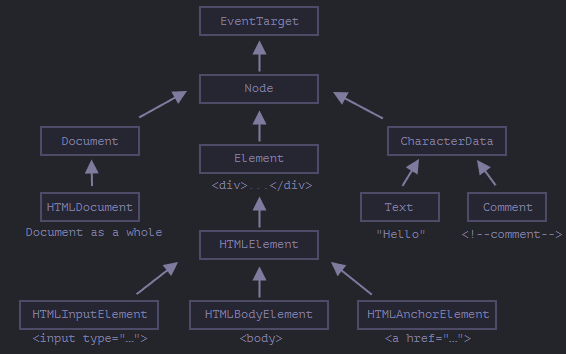

# **Node properties: type, tag and contents**

Let’s get a more in-depth look at DOM nodes.

In this chapter we’ll see more into what they are and learn their most used properties.

---

## **Summary**

Each DOM node belongs to a certain class. The classes form a hierarchy. The full set of properties and methods come as the result of inheritance.

Main DOM node properties are:

`nodeType`
> We can use it to see if a node is a text or an element node. It has a numeric value: `1` for elements, `3` for text nodes, and a few others for other node types. Read-only.

`nodeName/tagName`
> For elements, tag name (uppercased unless XML-mode). For non-element nodes `nodeName` describes what it is. Read-only.

`innerHTML`
> The HTML content of the element. Can be modified.

`outerHTML`
> The full HTML of the element. A write operation into `elem.outerHTML` does not touch elem itself. Instead it gets replaced with the new HTML in the outer context.

`nodeValue/data`
> The content of a non-element node (text, comment). These two are almost the same, usually we use `data`. Can be modified.

`textContent`
> The text inside the element: HTML minus all `<tags>`. Writing into it puts the text inside the element, with all special characters and tags treated exactly as text. Can safely insert user-generated text and protect from unwanted HTML insertions.

`hidden`

> When set to `true`, does the same as CSS `display:none`.

DOM nodes also have other properties depending on their class. 

For instance, 
- `<input>` elements (`HTMLInputElement`) support value, type, while
- `<a>` elements (`HTMLAnchorElement`) support `href` etc. 

Most standard HTML attributes have a corresponding DOM property.

However, HTML attributes and DOM properties are not always the same, as we’ll see in the next chapter.

---

## **DOM node classes**

Different DOM nodes may have different properties. For instance, an element node corresponding to tag `<a>` has link-related properties, and the one corresponding to `<input>` has input-related properties and so on. Text nodes are not the same as element nodes. But there are also common properties and methods between all of them, because all classes of DOM nodes form a single hierarchy.

Each DOM node belongs to the corresponding built-in class.

The root of the hierarchy is `EventTarget`, that is inherited by `Node`, and other DOM nodes inherit from it.

Here’s the picture, explanations to follow: 

The classes are:

- <a href="https://dom.spec.whatwg.org/#eventtarget">EventTarget</a> – is the root “abstract” class for everything.

  Objects of that class are never created. It serves as a base, so that all DOM nodes support so-called “events”, we’ll study them later.

- <a href="https://dom.spec.whatwg.org/#interface-node">Node</a> – is also an “abstract” class, serving as a base for DOM nodes.

  It provides the core tree functionality: `parentNode`, `nextSibling`, `childNodes` and so on (they are getters). Objects of `Node` class are never created. But there are other classes that inherit from it (and so inherit the Node functionality).

- <a href="https://dom.spec.whatwg.org/#interface-document">Document</a>, for historical reasons often inherited by `HTMLDocument` (though the latest spec doesn’t dictate it) – is a document as a whole.

  The `document` global object belongs exactly to this class. It serves as an entry point to the DOM.

- <a href="https://dom.spec.whatwg.org/#interface-characterdata">CharacterData</a> – an “abstract” class, inherited by:

  - <a href="https://dom.spec.whatwg.org/#interface-text">Text</a> – the class corresponding to a text inside elements, e.g. `Hello` in `<p>Hello</p>`.
  - <a href="https://dom.spec.whatwg.org/#interface-comment">Comment</a> – the class for comments. They are not shown, but each comment becomes a member of DOM.

<a href="https://dom.spec.whatwg.org/#interface-element">Element</a> – is the base class for DOM elements.

It provides element-level navigation like `nextElementSibling`, `children` and searching methods like `getElementsByTagName`, `querySelector`.

  A browser supports not only HTML, but also XML and SVG. So the `Element` class serves as a base for more specific classes: `SVGElement`, `XMLElement` (we don’t need them here) and `HTMLElement`.

- Finally, <a href="https://html.spec.whatwg.org/multipage/dom.html#htmlelement">HTMLElement</a> is the basic class for all HTML elements. We’ll work with it most of the time.

It is inherited by concrete HTML elements:

  - <a href="https://html.spec.whatwg.org/multipage/forms.html#htmlinputelement">HTMLInputElement</a> – the class for `<input>` elements,
  - <a href="https://html.spec.whatwg.org/multipage/semantics.html#htmlbodyelement">HTMLBodyElement</a> – the class for `<body>` elements,
  - <a href="https://html.spec.whatwg.org/multipage/semantics.html#htmlanchorelement">HTMLAnchorElement</a> – the class for `<a>` elements,
  - …and so on.

There are many other tags with their own classes that may have specific properties and methods, while some elements, such as `<span>`, `<section>`, `<article>` do not have any specific properties, so they are instances of `HTMLElement` class.

So, the full set of properties and methods of a given node comes as the result of the chain of inheritance.

For example, let’s consider the DOM object for an `<input>` element. It belongs to `HTMLInputElement` class.

It gets properties and methods as a superposition of (listed in inheritance order):

- `HTMLInputElement` – this class provides input-specific properties,

- `HTMLElement` – it provides common HTML element methods (and getters/setters),

- `Element` – provides generic element methods,
- `Node` – provides common DOM node properties,
- `EventTarget` – gives the support for events,
- …and finally it inherits from `Object`, so “plain object” methods like `hasOwnProperty` are also available.

---

To see the DOM node class name, we can recall that an object usually has the `constructor` property. It references the class constructor, and `constructor.name` is its name:

```javascript
alert( document.body.constructor.name ); // HTMLBodyElement
```

…Or we can just `toString` it:

```javascript
alert( document.body ); // [object HTMLBodyElement]
```

We also can use `instanceof` to check the inheritance:
```javascript
alert( document.body instanceof HTMLBodyElement ); // true
alert( document.body instanceof HTMLElement ); // true
alert( document.body instanceof Element ); // true
alert( document.body instanceof Node ); // true
alert( document.body instanceof EventTarget ); // true
```

As we can see, DOM nodes are regular JavaScript objects. They use prototype-based classes for inheritance.

That’s also easy to see by outputting an element with `console.dir(elem)` in a browser. There in the console you can see `HTMLElement.prototype`, `Element.prototype` and so on.

---

### `console.dir(elem)` **versus** `console.log(elem)`

Most browsers support two commands in their developer tools: `console.log` and `console.dir`. They output their arguments to the console. For JavaScript objects these commands usually do the same.

But for DOM elements they are different:

- `console.log(elem)` shows the element DOM tree.
- `console.dir(elem)` shows the element as a DOM object, good to explore its properties.

Try it on `document.body`.

---

### **IDL in the spec**

In the specification, DOM classes aren’t described by using JavaScript, but a special <a href="https://en.wikipedia.org/wiki/Interface_description_language">Interface description language</a> (IDL), that is usually easy to understand.

In IDL all properties are prepended with their types. For instance, DOMString, boolean and so on.

Here’s an excerpt from it, with comments:

```javascript
// Define HTMLInputElement
// The colon ":" means that HTMLInputElement inherits from HTMLElement
interface HTMLInputElement: HTMLElement {
  // here go properties and methods of <input> elements

  // "DOMString" means that the value of a property is a string
  attribute DOMString accept;
  attribute DOMString alt;
  attribute DOMString autocomplete;
  attribute DOMString value;

  // boolean value property (true/false)
  attribute boolean autofocus;
  ...
  // now the method: "void" means that the method returns no value
  void select();
  ...
}
```

---

## **The “nodeType” property**

The `nodeType` property provides one more, “old-fashioned” way to get the “type” of a DOM node.

It has a numeric value:

  - `elem.nodeType == 1` for element nodes,
  - `elem.nodeType == 3` for text nodes,
  - `elem.nodeType == 9` for the document object,
  - there are few other values in the [specification](https://dom.spec.whatwg.org/#node).

For instance:

```html
<body>
  <script>
  let elem = document.body;

  // let's examine: what type of node is in elem?
  alert(elem.nodeType); // 1 => element

  // and its first child is...
  alert(elem.firstChild.nodeType); // 3 => text

  // for the document object, the type is 9
  alert( document.nodeType ); // 9
  </script>
</body>
```

In modern scripts, we can use `instanceof` and other class-based tests to see the node type, but sometimes `nodeType` may be simpler. We can only read `nodeType`, not change it.

---

## **Tag: nodeName and tagName**

Given a DOM node, we can read its tag name from `nodeName` or `tagName` properties:

For instance:

```javascript
alert( document.body.nodeName ); // BODY
alert( document.body.tagName ); // BODY
```

Is there any difference between `tagName` and `nodeName`?

Sure, the difference is reflected in their names, but is indeed a bit subtle.

  - The `tagName` property exists only for `Element` nodes.
  - The `nodeName` is defined for any `Node`:
    - for elements it means the same as `tagName`.
    - for other node types (text, comment, etc.) it has a string with the node type.

In other words, `tagName` is only supported by element nodes (as it originates from Element class), while `nodeName` can say something about other node types.

For instance, let’s compare `tagName` and `nodeName` for the `document` and a comment node:

```html
<body><!-- comment -->

  <script>
    // for comment
    alert( document.body.firstChild.tagName ); // undefined (not an element)
    alert( document.body.firstChild.nodeName ); // #comment

    // for document
    alert( document.tagName ); // undefined (not an element)
    alert( document.nodeName ); // #document
  </script>
</body>
```

If we only deal with elements, then we can use both `tagName` and `nodeName` – there’s no difference.

---

### **The tag name is always uppercase except in XML mode**

The browser has two modes of processing documents: HTML and XML. Usually the HTML-mode is used for webpages. XML-mode is enabled when the browser receives an XML-document with the header: `Content-Type: application/xml+xhtml`.

In HTML mode `tagName/nodeName` is always uppercased: it’s `BODY` either for `<body>` or `<BoDy>`.

In XML mode the case is kept “as is”. Nowadays XML mode is rarely used.

---

## **innerHTML: the contents**

The [innerHTML](https://w3c.github.io/DOM-Parsing/#the-innerhtml-mixin) property allows to get the HTML inside the element as a string.

We can also modify it. So it’s one of the most powerful ways to change the page.

The example shows the contents of `document.body` and then replaces it completely:

```html
<body>
  <p>A paragraph</p>
  <div>A div</div>

  <script>
    alert( document.body.innerHTML ); // read the current contents
    document.body.innerHTML = 'The new BODY!'; // replace it
  </script>

</body>
```

We can try to insert invalid HTML, the browser will fix our errors:

```html
<body>

  <script>
    document.body.innerHTML = '<b>test'; // forgot to close the tag
    alert( document.body.innerHTML ); // <b>test</b> (fixed)
  </script>

</body>
```

### **Scripts don’t execute**
If `innerHTML` inserts a `<script>` tag into the document – it becomes a part of HTML, but doesn’t execute.

--- 

## **Beware: “innerHTML+=” does a full overwrite** 

We can append HTML to an element by using `elem.innerHTML+="more html"`.

Like this:

```javascript
chatDiv.innerHTML += "<div>Hello !</div>";
chatDiv.innerHTML += "How goes?";
```

But we should be very careful about doing it, because what’s going on is not an addition, but a full overwrite.

Technically, these two lines do the same:
```javascript
elem.innerHTML += "...";
// is a shorter way to write:
elem.innerHTML = elem.innerHTML + "..."
```

In other words, `innerHTML+=` does this:

  1. The old contents is removed.
  2. The new `innerHTML` is written instead (a concatenation of the old and the new one).

**As the content is “zeroed-out” and rewritten from the scratch, all images and other resources will be reloaded.**

In the `chatDiv` example above the line` chatDiv.innerHTML+="How goes?"` re-creates the HTML content and reloads `smile.gif` (hope it’s cached). If `chatDiv` has a lot of other text and images, then the reload becomes clearly visible.

There are other side-effects as well. For instance, if the existing text was selected with the mouse, then most browsers will remove the selection upon rewriting `innerHTML`. And if there was an `<input>` with a text entered by the visitor, then the text will be removed. And so on.

Luckily, there are other ways to add HTML besides `innerHTML`, and we’ll study them soon.

---

## **outerHTML: full HTML of the element**

The outerHTML property contains the full HTML of the element. That’s like innerHTML plus the element itself.

Here’s an example:

```html
<div id="elem">Hello <b>World</b></div>

<script>
  alert(elem.outerHTML); // <div id="elem">Hello <b>World</b></div>
</script>
```

***Beware*: unlike `innerHTML`, writing to `outerHTML` does not change the element. Instead, it replaces it in the DOM.**

Yeah, sounds strange, and strange it is, that’s why we make a separate note about it here. Take a look.

Consider the example:

```html
<div>Hello, world!</div>

<script>
  let div = document.querySelector('div');

  // replace div.outerHTML with <p>...</p>
  div.outerHTML = '<p>A new element</p>'; // (*)

  // Wow! 'div' is still the same!
  alert(div.outerHTML); // <div>Hello, world!</div> (**)
</script>
```

Looks really odd, right?

In the line `(*)` we replaced `div` with `<p>A new element</p>`. In the outer document (the DOM) we can see the new content instead of the `<div>`. But, as we can see in line `(**)`, the value of the old `div` variable hasn’t changed!

The `outerHTML` assignment does not modify the DOM element (the object referenced by, in this case, the variable ‘div’), but removes it from the DOM and inserts the new HTML in its place.

So what happened in `div.outerHTML=...` is:

  - `div` was removed from the document.
  - Another piece of HTML `<p>A new element</p>` was inserted in its place.
  - `div` still has its old value. The new HTML wasn’t saved to any variable.

It’s so easy to make an error here: modify `div.outerHTML` and then continue to work with `div` as if it had the new content in it. But it doesn’t. Such thing is correct for `innerHTML`, but not for `outerHTML`.

We can write to `elem.outerHTML`, but should keep in mind that it doesn’t change the element we’re writing to (‘elem’). It puts the new HTML in its place instead. We can get references to the new elements by querying the DOM.

---

## **nodeValue/data: text node content**

The `innerHTML` property is only valid for element nodes.

Other node types, such as text nodes, have their counterpart: `nodeValue` and `data` properties. These two are almost the same for practical use, there are only minor specification differences. So we’ll use `data`, because it’s shorter.

An example of reading the content of a text node and a comment:

```html
<body>
  Hello
  <!-- Comment -->
  <script>
    let text = document.body.firstChild;
    alert(text.data); // Hello

    let comment = text.nextSibling;
    alert(comment.data); // Comment
  </script>
</body>
```

For text nodes we can imagine a reason to read or modify them, but why comments?

Sometimes developers embed information or template instructions into HTML in them, like this:

```html
<!-- if isAdmin -->
  <div>Welcome, Admin!</div>
<!-- /if -->
```
…Then JavaScript can read it from data property and process embedded instructions.

---