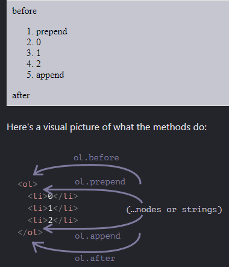

# Modifying the document
DOM modification is the key to creating “live” pages.

Here we’ll see how to create new elements “on the fly” and modify the existing page content.

## Summary 

- Methods to create new nodes:
    - `document.createElement(tag)` -- creates an element with the given tag,
    - `document.createTextNode(value)` -- creates a text node (rarely used),
    - `elem.cloneNode(deep)` -- clones the element, if `deep==true` then with all descendants.  

- Insertion and removal:
    - `node.append(...nodes or strings)` -- insert into `node`, at the end,
    - `node.prepend(...nodes or strings)` -- insert into `node`, at the beginning,
    - `node.before(...nodes or strings)` –- insert right before `node`,
    - `node.after(...nodes or strings)` –- insert right after `node`,
    - `node.replaceWith(...nodes or strings)` –- replace `node`.
    - `node.remove()` –- remove the `node`.

    Text strings are inserted "as text".

- There are also "old school" methods:
    - `parent.appendChild(node)`
    - `parent.insertBefore(node, nextSibling)`
    - `parent.removeChild(node)`
    - `parent.replaceChild(newElem, node)`

    All these methods return `node`.

- Given some HTML in `html`, `elem.insertAdjacentHTML(where, html)` inserts it depending on the value of `where`:
    - `"beforebegin"` -- insert `html` right before `elem`,
    - `"afterbegin"` -- insert `html` into `elem`, at the beginning,
    - `"beforeend"` -- insert `html` into `elem`, at the end,
    - `"afterend"` -- insert `html` right after `elem`.

    Also there are similar methods, `elem.insertAdjacentText` and `elem.insertAdjacentElement`, that insert text strings and elements, but they are rarely used.

- To append HTML to the page before it has finished loading:
    - `document.write(html)`

    After the page is loaded such a call erases the document. Mostly seen in old scripts.

---

DOM modification is the key to creating "live" pages.

Here we'll see how to create new elements "on the fly" and modify the existing page content.

## Example: show a message

Let's demonstrate using an example. We'll add a message on the page that looks nicer than `alert`.

Here's how it will look:

```html autorun height="80"
<style>
.alert {
  padding: 15px;
  border: 1px solid #d6e9c6;
  border-radius: 4px;
  color: #3c763d;
  background-color: #dff0d8;
}
</style>

<div class="alert">
  <strong>Hi there!</strong> You've read an important message.
</div>
```

That was the HTML example. Now let's create the same `div` with JavaScript (assuming that the styles are in the HTML/CSS already).

## Creating an element

To create DOM nodes, there are two methods:

`document.createElement(tag)` : Creates a new *element node* with the given tag:

```js
let div = document.createElement('div');
```

`document.createTextNode(text)` : Creates a new *text node* with the given text:

```js
let textNode = document.createTextNode('Here I am');
```

Most of the time we need to create element nodes, such as the `div` for the message.

### Creating the message

Creating the message div takes 3 steps:

```js
// 1. Create <div> element
let div = document.createElement('div');

// 2. Set its class to "alert"
div.className = "alert";

// 3. Fill it with the content
div.innerHTML = "<strong>Hi there!</strong> You've read an important message.";
```

We've created the element. But as of now it's only in a variable named `div`, not in the page yet. So we can't see it.

## Insertion methods

To make the `div` show up, we need to insert it somewhere into `document`. For instance, into `<body>` element, referenced by `document.body`.

There's a special method `append` for that: `document.body.append(div)`.

Here's the full code:

```html run height="80"
<style>
.alert {
  padding: 15px;
  border: 1px solid #d6e9c6;
  border-radius: 4px;
  color: #3c763d;
  background-color: #dff0d8;
}
</style>

<script>
  let div = document.createElement('div');
  div.className = "alert";
  div.innerHTML = "<strong>Hi there!</strong> You've read an important message.";

  document.body.append(div);

</script>
```

Here we called `append` on `document.body`, but we can call `append` method on any other element, to put another element into it. For instance, we can append something to `<div>` by calling `div.append(anotherElement)`.

Here are more insertion methods, they specify different places where to insert:

- `node.append(...nodes or strings)` -- append nodes or strings *at the end* of `node`,
- `node.prepend(...nodes or strings)` -- insert nodes or strings *at the beginning* of `node`,
- `node.before(...nodes or strings)` –- insert nodes or strings *before* `node`,
- `node.after(...nodes or strings)` –- insert nodes or strings *after* `node`,
- `node.replaceWith(...nodes or strings)` –- replaces `node` with the given nodes or strings.

Arguments of these methods are an arbitrary list of DOM nodes to insert, or text strings (that become text nodes automatically).

Let's see them in action.

Here's an example of using these methods to add items to a list and the text before/after it:

```html autorun
<ol id="ol">
  <li>0</li>
  <li>1</li>
  <li>2</li>
</ol>

<script>
  ol.before('before'); // insert string "before" before <ol>
  ol.after('after'); // insert string "after" after <ol>

  let liFirst = document.createElement('li');
  liFirst.innerHTML = 'prepend';
  ol.prepend(liFirst); // insert liFirst at the beginning of <ol>

  let liLast = document.createElement('li');
  liLast.innerHTML = 'append';
  ol.append(liLast); // insert liLast at the end of <ol>
</script>
```



So the final list will be:

```html
before
<ol id="ol">
  <li>prepend</li>
  <li>0</li>
  <li>1</li>
  <li>2</li>
  <li>append</li>
</ol>
after
```

As said, these methods can insert multiple nodes and text pieces in a single call.

For instance, here a string and an element are inserted:

```html run
<div id="div"></div>
<script>
  div.before('<p>Hello</p>', document.createElement('hr'));
</script>
```

Please note: the text is inserted "as text", not "as HTML", with proper escaping of characters such as `<`, `>`.

So the final HTML is:

```html run

&lt;p&gt;Hello&lt;/p&gt;

<hr>
<div id="div"></div>
```

In other words, strings are inserted in a safe way, like `elem.textContent` does it.

So, these methods can only be used to insert DOM nodes or text pieces.

But what if we'd like to insert an HTML string "as html", with all tags and stuff working, in the same manner as `elem.innerHTML` does it?

