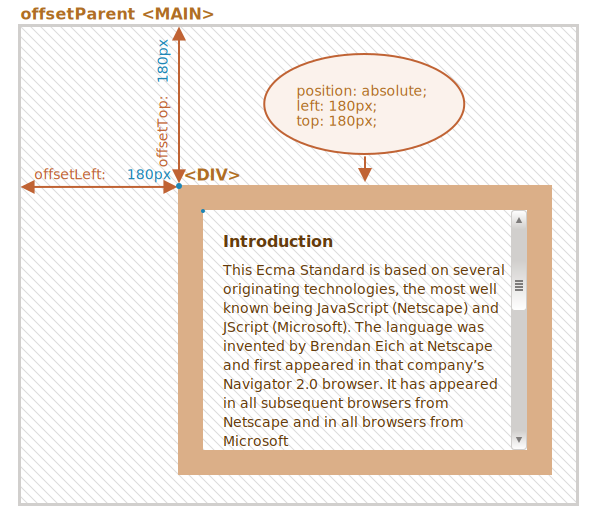
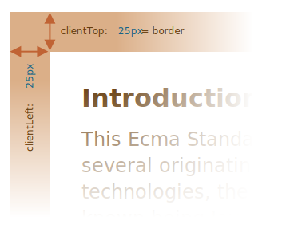

# Element size and scrolling

There are many JavaScript properties that allow us to read information about element width, height and other geometry features.

We often need them when moving or positioning elements in JavaScript.

## Summary

Elements have the following geometry properties:

- `offsetParent` -- is the nearest positioned ancestor or `td`, `th`, `table`, `body`.
- `offsetLeft/offsetTop` -- coordinates relative to the upper-left edge of `offsetParent`.
- `offsetWidth/offsetHeight` -- "outer" width/height of an element including borders.
- `clientLeft/clientTop` -- the distances from the upper-left outer corner to the upper-left inner (content + padding) corner. For left-to-right OS they are always the widths of left/top borders. For right-to-left OS the vertical scrollbar is on the left so `clientLeft` includes its width too.
- `clientWidth/clientHeight` -- the width/height of the content including paddings, but without the scrollbar.
- `scrollWidth/scrollHeight` -- the width/height of the content, just like `clientWidth/clientHeight`, but also include scrolled-out, invisible part of the element.
- `scrollLeft/scrollTop` -- width/height of the scrolled out upper part of the element, starting from its upper-left corner.

All properties are read-only except `scrollLeft/scrollTop` that make the browser scroll the element if changed.

## Sample element

As a sample element to demonstrate properties we'll use the one given below:

```html no-beautify
<div id="example">
  ...Text...
</div>
<style>
  #example {
    width: 300px;
    height: 200px;
    border: 25px solid #E8C48F;
    padding: 20px;
    overflow: auto;
  }
</style>
```

It has the border, padding and scrolling. The full set of features. There are no margins, as they are not the part of the element itself, and there are no special properties for them.

The element looks like this: 

### Mind the scrollbar

The picture above demonstrates the most complex case when the element has a scrollbar. Some browsers (not all) reserve the space for it by taking it from the content (labeled as "content width" above).

So, without scrollbar the content width would be `300px`, but if the scrollbar is `16px` wide (the width may vary between devices and browsers) then only `300 - 16 = 284px` remains, and we should take it into account. That's why examples from this chapter assume that there's a scrollbar. Without it, some calculations are simpler.

### The `padding-bottom` area may be filled with text

Usually paddings are shown empty on our illustrations, but if there's a lot of text in the element and it overflows, then browsers show the "overflowing" text at `padding-bottom`, that's normal.

## Geometry

Here's the overall picture with geometry properties:


Values of these properties are technically numbers, but these numbers are "of pixels", so these are pixel measurements.

Let's start exploring the properties starting from the outside of the element.

## offsetParent, offsetLeft/Top

These properties are rarely needed, but still they are the "most outer" geometry properties, so we'll start with them.

The `offsetParent` is the nearest ancestor that the browser uses for calculating coordinates during rendering.

That's the nearest ancestor that is one of the following:

1. CSS-positioned (`position` is `absolute`, `relative`, `fixed` or `sticky`),  or
2. `<td>`, `<th>`, or `<table>`,  or
3. `<body>`.

Properties `offsetLeft/offsetTop` provide x/y coordinates relative to `offsetParent` upper-left corner.

In the example below the inner `<div>` has `<main>` as `offsetParent` and `offsetLeft/offsetTop` shifts from its upper-left corner (`180`):

```html run height=10
<main style="position: relative" id="main">
  <article>
    <div id="example" style="position: absolute; left: 180px; top: 180px">...</div>
  </article>
</main>
<script>
  alert(example.offsetParent.id); // main
  alert(example.offsetLeft); // 180 (note: a number, not a string "180px")
  alert(example.offsetTop); // 180
</script>
```



There are several occasions when `offsetParent` is `null`:

1. For not shown elements (`display:none` or not in the document).
2. For `<body>` and `<html>`.
3. For elements with `position:fixed`.

## offsetWidth/Height

Now let's move on to the element itself.

These two properties are the simplest ones. They provide the "outer" width/height of the element. Or, in other words, its full size including borders.


For our sample element:

- `offsetWidth = 390` -- the outer width, can be calculated as inner CSS-width (`300px`) plus paddings (`2 * 20px`) and borders (`2 * 25px`).
- `offsetHeight = 290` -- the outer height.

### Geometry properties are zero/null for elements that are not displayed

Geometry properties are calculated only for displayed elements.

If an element (or any of its ancestors) has `display:none` or is not in the document, then all geometry properties are zero (or `null` for `offsetParent`).

For example, `offsetParent` is `null`, and `offsetWidth`, `offsetHeight` are `0` when we created an element, but haven't inserted it into the document yet, or it (or its ancestor) has `display:none`.

We can use this to check if an element is hidden, like this:

```js
function isHidden(elem) {
  return !elem.offsetWidth && !elem.offsetHeight;
}
```

Please note that such `isHidden` returns `true` for elements that are on-screen, but have zero sizes.

## clientTop/Left

Inside the element we have the borders.

To measure them, there are properties `clientTop` and `clientLeft`.

In our example:

- `clientLeft = 25` -- left border width
- `clientTop = 25` -- top border width



...But to be precise -- these properties are not border width/height, but rather relative coordinates of the inner side from the outer side.

What's the difference?

It becomes visible when the document is right-to-left (the operating system is in Arabic or Hebrew languages). The scrollbar is then not on the right, but on the left, and then `clientLeft` also includes the scrollbar width.

In that case, `clientLeft` would be not `25`, but with the scrollbar width `25 + 16 = 41`.

Here's the example in hebrew:


