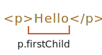
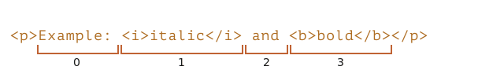
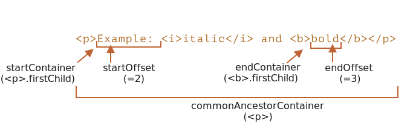

# Selection and Range

In this chapter we'll cover selection in the document, as well as selection in form fields, such as `<input>`.

JavaScript can access an existing selection, select/deselect DOM nodes as a whole or partially, remove the selected content from the document, wrap it into a tag, and so on.

You can find some recipes for common tasks at the end of the chapter, in "Summary" section. Maybe that covers your current needs, but you'll get much more if you read the whole text.

The underlying `Range` and `Selection` objects are easy to grasp, and then you'll need no recipes to make them do what you want.

---

## Summary

We covered two different APIs for selections:

1. For document: `Selection` and `Range` objects.
2. For `input`, `textarea`: additional methods and properties.

The second API is very simple, as it works with text.

The most used recipes are probably:

1. Getting the selection:
    ```js
    let selection = document.getSelection();

    let cloned = /* element to clone the selected nodes to */;

    // then apply Range methods to selection.getRangeAt(0)
    // or, like here, to all ranges to support multi-select
    for (let i = 0; i < selection.rangeCount; i++) {
      cloned.append(selection.getRangeAt(i).cloneContents());
    }
    ```
2. Setting the selection:
    ```js
    let selection = document.getSelection();

    // directly:
    selection.setBaseAndExtent(...from...to...);

    // or we can create a range and:
    selection.removeAllRanges();
    selection.addRange(range);
    ```

And finally, about the cursor. The cursor position in editable elements, like `<textarea>` is always at the start or the end of the selection. We can use it  to get cursor position or to move the cursor by setting `elem.selectionStart` and `elem.selectionEnd`.

---

## Range

The basic concept of selection is [Range](https://dom.spec.whatwg.org/#ranges), that is essentially a pair of "boundary points": range start and range end.

A `Range` object is created without parameters:

```js
let range = new Range();
```

Then we can set the selection boundaries using `range.setStart(node, offset)` and `range.setEnd(node, offset)`.

As you might guess, further we'll use the `Range` objects for selection, but first let's create few such objects.

### Selecting the text partially

The interesting thing is that the first argument `node` in both methods can be either a text node or an element node, and the meaning of the second argument depends on that.

**If `node` is a text node, then `offset` must be the position in its text.**

For example, given the element `<p>Hello</p>`, we can create the range containing the letters "ll" as follows:

```html run
<p id="p">Hello</p>
<script>
  let range = new Range();
  range.setStart(p.firstChild, 2);
  range.setEnd(p.firstChild, 4);
  
  // toString of a range returns its content as text
  console.log(range); // ll
</script>
```

Here we take the first child of `<p>` (that's the text node) and specify the text positions inside it:



### Selecting element nodes

**Alternatively, if `node` is an element node, then `offset` must be the child number.** 

That's handy for making ranges that contain nodes as a whole, not stop somewhere inside their text.

For example, we have a more complex document fragment:

```html autorun
<p id="p">Example: <i>italic</i> and <b>bold</b></p>
```

Here's its DOM structure with both element and text nodes:

<div class="select-p-domtree"></div>

<script>
let selectPDomtree = {
  "name": "P",
  "nodeType": 1,
  "children": [{
    "name": "#text",
    "nodeType": 3,
    "content": "Example: "
  }, {
    "name": "I",
    "nodeType": 1,
    "children": [{
      "name": "#text",
      "nodeType": 3,
      "content": "italic"
    }]
  }, {
    "name": "#text",
    "nodeType": 3,
    "content": " and "
  }, {
    "name": "B",
    "nodeType": 1,
    "children": [{
      "name": "#text",
      "nodeType": 3,
      "content": "bold"
    }]
  }]
}

drawHtmlTree(selectPDomtree, 'div.select-p-domtree', 690, 320);
</script>

Let's make a range for `"Example: <i>italic</i>"`.

As we can see, this phrase consists of exactly two children of `<p>`, with indexes `0` and `1`:


- The starting point has `<p>` as the parent `node`, and `0` as the offset.

    So we can set it as `range.setStart(p, 0)`.
- The ending point also has `<p>` as the parent `node`, but `2` as the offset (it specifies the range up to, but not including `offset`).

    So we can set it as `range.setEnd(p, 2)`.

Here's the demo. If you run it, you can see that the text gets selected:

```html run
<p id="p">Example: <i>italic</i> and <b>bold</b></p>

<script>
*!*
  let range = new Range();

  range.setStart(p, 0);
  range.setEnd(p, 2);
*/!*

  // toString of a range returns its content as text, without tags
  console.log(range); // Example: italic

  // apply this range for document selection (explained later below)
  document.getSelection().addRange(range);
</script>
```

Here's a more flexible test stand where you can set range start/end numbers and explore other variants:

```html run autorun
<p id="p">Example: <i>italic</i> and <b>bold</b></p>

From <input id="start" type="number" value=1> – To <input id="end" type="number" value=4>
<button id="button">Click to select</button>
<script>
  button.onclick = () => {
  *!*
    let range = new Range();

    range.setStart(p, start.value);
    range.setEnd(p, end.value);
  */!*

    // apply the selection, explained later below
    document.getSelection().removeAllRanges();
    document.getSelection().addRange(range);
  };
</script>
```

E.g. selecting in the same `<p>` from offset `1` to `4` gives us the range `<i>italic</i> and <b>bold</b>`:



---

### Starting and ending nodes can be different

We don't have to use the same node in `setStart` and `setEnd`. A range may span across many unrelated nodes. It's only important that the end is after the start in the document.

---

### Selecting a bigger fragment

Let's make a bigger selection in our example, like this:


We already know how to do that. We just need to set the start and the end as a relative offset in text nodes.

We need to create a range, that:
- starts from position 2 in `<p>` first child (taking all but two first letters of "Ex<b>ample:</b> ")
- ends at the position 3 in `<b>` first child (taking first three letters of "<b>bol</b>d", but no more):

```html run
<p id="p">Example: <i>italic</i> and <b>bold</b></p>

<script>
  let range = new Range();

  range.setStart(p.firstChild, 2);
  range.setEnd(p.querySelector('b').firstChild, 3);

  console.log(range); // ample: italic and bol

  // use this range for selection (explained later)
  window.getSelection().addRange(range);
</script>
```

As you can see, it's fairly easy to make a range of whatever we want.

If we'd like to take nodes as a whole, we can pass elements in `setStart/setEnd`. Otherwise, we can work on the text level. 

## Range properties

The range object that we created in the example above has following properties:



- `startContainer`, `startOffset` -- node and offset of the start,
  - in the example above: first text node inside `<p>` and `2`.
- `endContainer`, `endOffset` -- node and offset of the end,
  - in the example above: first text node inside `<b>` and `3`.
- `collapsed` -- boolean, `true` if the range starts and ends on the same point (so there's no content inside the range),
  - in the example above: `false`
- `commonAncestorContainer` -- the nearest common ancestor of all nodes within the range,
  - in the example above: `<p>`

## Range selection methods

There are many convenient methods to manipulate ranges.

We've already seen `setStart` and `setEnd`, here are other similar methods.

Set range start:

- `setStart(node, offset)` set start at: position `offset` in `node`
- `setStartBefore(node)` set start at: right before `node`
- `setStartAfter(node)` set start at: right after `node`

Set range end (similar methods):

- `setEnd(node, offset)` set end at: position `offset` in `node`
- `setEndBefore(node)` set end at: right before `node`
- `setEndAfter(node)` set end at: right after `node`

Technically, `setStart/setEnd` can do anything, but more methods provide more convenience.

In all these methods, `node` can be both a text or element node: for text nodes `offset` skips that many of characters, while for element nodes that many child nodes.

Even more methods to create ranges:
- `selectNode(node)` set range to select the whole `node`
- `selectNodeContents(node)` set range to select the whole `node` contents
- `collapse(toStart)` if `toStart=true` set end=start, otherwise set start=end, thus collapsing the range
- `cloneRange()` creates a new range with the same start/end

## Range editing methods

Once the range is created, we can manipulate its content using these methods:

- `deleteContents()` -- remove range content from the document
- `extractContents()` -- remove range content from the document and return as [DocumentFragment](info:modifying-document#document-fragment)
- `cloneContents()` -- clone range content and return as [DocumentFragment](info:modifying-document#document-fragment)
- `insertNode(node)` -- insert `node` into the document at the beginning of the range
- `surroundContents(node)` -- wrap `node` around range content. For this to work, the range must contain both opening and closing tags for all elements inside it: no partial ranges like `<i>abc`.

With these methods we can do basically anything with selected nodes.

Here's the test stand to see them in action:

```html run refresh autorun height=260
Click buttons to run methods on the selection, "resetExample" to reset it.

<p id="p">Example: <i>italic</i> and <b>bold</b></p>

<p id="result"></p>
<script>
  let range = new Range();

  // Each demonstrated method is represented here:
  let methods = {
    deleteContents() {
      range.deleteContents()
    },
    extractContents() {
      let content = range.extractContents();
      result.innerHTML = "";
      result.append("extracted: ", content);
    },
    cloneContents() {
      let content = range.cloneContents();
      result.innerHTML = "";
      result.append("cloned: ", content);
    },
    insertNode() {
      let newNode = document.createElement('u');
      newNode.innerHTML = "NEW NODE";
      range.insertNode(newNode);
    },
    surroundContents() {
      let newNode = document.createElement('u');
      try {
        range.surroundContents(newNode);
      } catch(e) { console.log(e) }
    },
    resetExample() {
      p.innerHTML = `Example: <i>italic</i> and <b>bold</b>`;
      result.innerHTML = "";

      range.setStart(p.firstChild, 2);
      range.setEnd(p.querySelector('b').firstChild, 3);

      window.getSelection().removeAllRanges();  
      window.getSelection().addRange(range);  
    }
  };

  for(let method in methods) {
    document.write(`<div><button onclick="methods.${method}()">${method}</button></div>`);
  }

  methods.resetExample();
</script>
```

There also exist methods to compare ranges, but these are rarely used. When you need them, please refer to the [spec](https://dom.spec.whatwg.org/#interface-range) or [MDN manual](mdn:/api/Range).

---

## Selection

`Range` is a generic object for managing selection ranges. Although, creating a `Range` doesn't mean that we see a selection on screen.

We may create `Range` objects, pass them around -- they do not visually select anything on their own.

The document selection is represented by `Selection` object, that can be obtained as `window.getSelection()` or `document.getSelection()`. A selection may include zero or more ranges. At least, the [Selection API specification](https://www.w3.org/TR/selection-api/) says so. In practice though, only Firefox allows to select multiple ranges in the document by using `key:Ctrl+click` (`key:Cmd+click` for Mac).

Here's a screenshot of a selection with 3 ranges, made in Firefox:


Other browsers support at maximum 1 range. As we'll see, some of `Selection` methods imply that there may be many ranges, but again, in all browsers except Firefox, there's at maximum 1.

Here's a small demo that shows the current selection (select something and click) as text:

<button onclick="alert(document.getSelection())">alert(document.getSelection())</button>

## Selection properties

As said, a selection may in theory contain multiple ranges. We can get these range objects using the method:

- `getRangeAt(i)` -- get i-th range, starting from `0`. In all browsers except Firefox, only `0` is used.

Also, there exist properties that often provide better convenience.

Similar to a range, a selection object has a start, called "anchor", and the end, called "focus".

The main selection properties are:

- `anchorNode` -- the node where the selection starts,
- `anchorOffset` -- the offset in `anchorNode` where the selection starts,
- `focusNode` -- the node where the selection ends,
- `focusOffset` -- the offset in `focusNode` where the selection ends,
- `isCollapsed` -- `true` if selection selects nothing (empty range), or doesn't exist.
- `rangeCount` -- count of ranges in the selection, maximum `1` in all browsers except Firefox.

---

### Selection end/start vs Range

There's an important differences of a selection anchor/focus compared with a `Range` start/end.

As we know, `Range` objects always have their start before the end. 

For selections, that's not always the case.

Selecting something with a mouse can be done in both directions: either "left-to-right" or "right-to-left".

In other words, when the mouse button is pressed, and then it moves forward in the document, then its end (focus) will be after its start (anchor).

E.g. if the user starts selecting with mouse and goes from "Example" to "italic":


...But the same selection could be done backwards: starting from  "italic" to "Example" (backward direction), then its end (focus) will be before the start (anchor):


---

## References

- [DOM spec: Range](https://dom.spec.whatwg.org/#ranges)
- [Selection API](https://www.w3.org/TR/selection-api/#dom-globaleventhandlers-onselectstart)
- [HTML spec: APIs for the text control selections](https://html.spec.whatwg.org/multipage/form-control-infrastructure.html#textFieldSelection)