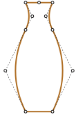

# Summary | Bezier Curve

Bezier curves are defined by their control points.

We saw two definitions of Bezier curves:

1. Using a drawing process: De Casteljau's algorithm.
2. Using a mathematical formulas.

Good properties of Bezier curves:

- We can draw smooth lines with a mouse by moving control points.
- Complex shapes can be made of several Bezier curves.

Usage:

- In computer graphics, modeling, vector graphic editors. Fonts are described by Bezier curves.
- In web development -- for graphics on Canvas and in the SVG format. By the way, "live" examples above are written in SVG. They are actually a single SVG document that is given different points as parameters. You can open it in a separate window and see the source: [demo.svg](demo.svg?p=0,0,1,0.5,0,0.5,1,1&animate=1).
- In CSS animation to describe the path and speed of animation.

---

Bezier curves are used in computer graphics to draw shapes, for CSS animation and in many other places.

They are a very simple thing, worth to study once and then feel comfortable in the world of vector graphics and advanced animations.

---

### Theory

This article provides a theoretical, but very needed insight into what Bezier curves are, while [the next one](info:css-animations#bezier-curve) shows how we can use them for CSS animations.

---

## Control points

A [bezier curve](https://en.wikipedia.org/wiki/B%C3%A9zier_curve) is defined by control points.

There may be 2, 3, 4 or more.

For instance, two points curve:

Three points curve:

Four points curve:

If you look closely at these curves, you can immediately notice:

1. **Points are not always on curve.** That's perfectly normal, later we'll see how the curve is built.
2. **The curve order equals the number of points minus one**.
For two points we have a linear curve (that's a straight line), for three points -- quadratic curve (parabolic), for four points -- cubic curve.
3. **A curve is always inside the [convex hull](https://en.wikipedia.org/wiki/Convex_hull) of control points:**

     

Because of that last property, in computer graphics it's possible to optimize intersection tests. If convex hulls do not intersect, then curves do not either. So checking for the convex hulls intersection first can give a very fast "no intersection" result. Checking the intersection of convex hulls is much easier, because they are rectangles, triangles and so on (see the picture above), much simpler figures than the curve.

**The main value of Bezier curves for drawing -- by moving the points the curve is changing *in intuitively obvious way*.**

Try to move control points using a mouse in the example below:

[iframe src="demo.svg?nocpath=1&p=0,0,0.5,0,0.5,1,1,1" height=370]

**As you can notice, the curve stretches along the tangential lines 1 -> 2 and 3 -> 4.**

After some practice it becomes obvious how to place points to get the needed curve. And by connecting several curves we can get practically anything.

Here are some examples:

  

## De Casteljau's algorithm