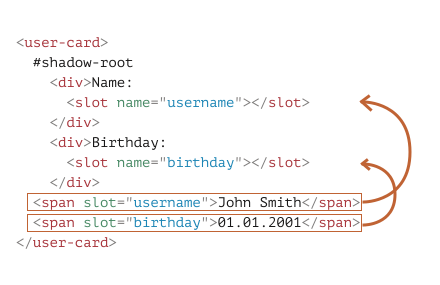

# Summary | ShadowDOM slots, composition

Usually, if an element has shadow DOM, then its light DOM is not displayed. Slots allow to show elements from light DOM in specified places of shadow DOM.

There are two kinds of slots:

- Named slots: `<slot name="X">...</slot>` -- gets light children with `slot="X"`.
- Default slot: the first `<slot>` without a name (subsequent unnamed slots are ignored) -- gets unslotted light children.
- If there are many elements for the same slot -- they are appended one after another.
- The content of `<slot>` element is used as a fallback. It's shown if there are no light children for the slot.

The process of rendering slotted elements inside their slots is called "composition". The result is called a "flattened DOM".

Composition does not really move nodes, from JavaScript point of view the DOM is still same.

JavaScript can access slots using methods:
- `slot.assignedNodes/Elements()` -- returns nodes/elements inside the `slot`.
- `node.assignedSlot` -- the reverse property, returns slot by a node.

If we'd like to know what we're showing, we can track slot contents using:
- `slotchange` event -- triggers the first time a slot is filled, and on any add/remove/replace operation of the slotted element, but not its children. The slot is `event.target`.
- [MutationObserver](info:mutation-observer) to go deeper into slot content, watch changes inside it.

Now, as we know how to show elements from light DOM in shadow DOM, let's see how to style them properly. The basic rule is that shadow elements are styled inside, and light elements -- outside, but there are notable exceptions.

---

# Shadow DOM slots, composition

Many types of components, such as tabs, menus, image galleries, and so on, need the content to render.

Just like built-in browser `<select>` expects `<option>` items, our `<custom-tabs>` may expect the actual tab content to be passed. And a `<custom-menu>` may expect menu items.

The code that makes use of `<custom-menu>` can look like this:

```html
<custom-menu>
  <title>Candy menu</title>
  <item>Lollipop</item>
  <item>Fruit Toast</item>
  <item>Cup Cake</item>
</custom-menu>
```

...Then our component should render it properly, as a nice menu with given title and items, handle menu events, etc.

How to implement it?

We could try to analyze the element content and dynamically copy-rearrange DOM nodes. That's possible, but if we're moving elements to shadow DOM, then CSS styles from the document do not apply in there, so the visual styling may be lost. Also that requires some coding.

Luckily, we don't have to. Shadow DOM supports `<slot>` elements, that are automatically filled by the content from light DOM.

## Named slots

Let's see how slots work on a simple example.

Here, `<user-card>` shadow DOM provides two slots, filled from light DOM:

```html run autorun="no-epub" untrusted height=80
<script>
customElements.define('user-card', class extends HTMLElement {
  connectedCallback() {
    this.attachShadow({mode: 'open'});
    this.shadowRoot.innerHTML = `
      <div>Name:
*!*
        <slot name="username"></slot>
*/!*
      </div>
      <div>Birthday:
*!*
        <slot name="birthday"></slot>
*/!*
      </div>
    `;
  }
});
</script>

<user-card>
  <span *!*slot="username"*/!*>John Smith</span>
  <span *!*slot="birthday"*/!*>01.01.2001</span>
</user-card>
```

In the shadow DOM, `<slot name="X">` defines an "insertion point", a place where elements with `slot="X"` are rendered.

Then the browser performs "composition": it takes elements from the light DOM and renders them in corresponding slots of the shadow DOM. At the end, we have exactly what we want -- a component that can be filled with data.

Here's the DOM structure after the script, not taking composition into account:

```html
<user-card>
  #shadow-root
    <div>Name:
      <slot name="username"></slot>
    </div>
    <div>Birthday:
      <slot name="birthday"></slot>
    </div>
  <span slot="username">John Smith</span>
  <span slot="birthday">01.01.2001</span>
</user-card>
```

We created the shadow DOM, so here it is, under `#shadow-root`. Now the element has both light and shadow DOM.

For rendering purposes, for each `<slot name="...">` in shadow DOM, the browser looks for `slot="..."` with the same name in the light DOM. These elements are rendered inside the slots:

